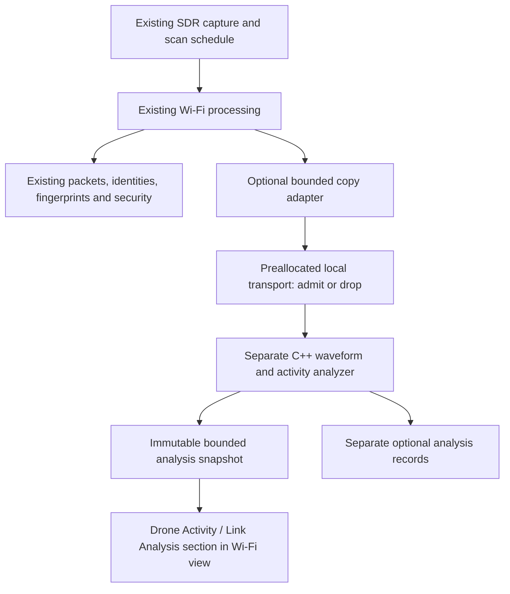

# Wi-Fi cyclostationary drone-link analysis: additive integration plan

Date: 8 October 2026
Revision: S — discovery-selected timing grids and held checks; Mini 2 pilot, ML and Remote ID deferred
Status: offline DSP, experimental evidence policy and development worker/panel implemented; full waveform, drone attribution and live release gates pending
Target: the existing C++/Dear ImGui Wi-Fi 2.4 GHz and Wi-Fi 5 GHz views

Revision K delivers an initial **experimental** `experimental_dsp_v1` waveform policy, not validated drone attribution. Generic OFDM/chirp morphology is assessed separately from observed window quality and declared passband geometry. The optional panel shows checks/reasons; live passband and ADC rails remain unknown. An explicit default-off private-copy pre-downmix DC option diagnoses a translated-mean artifact. A frozen-policy 96-case software/control benchmark and 399-recording / 1,587-window replay are recorded, including multipath/mixture/noise misses. Previous DSP values and source-window hashes remain identical. No ML, RID, radio settings, identity/security decisions or named-family acceptance were added. R3/M2 remain partial; independent references and G2/G2A/live non-interference gates remain open. Details and remaining milestones are in the [reference-validation record](/home/sudeep/Documents/newrocktest-cpp/docs/WIFI_CYCLOSTATIONARY_REFERENCE_VALIDATION.md).

Revision L (5 October 2026) follows the user's request to park Mini 2-specific testing and improve general cyclostationary analysis. The [next-step plan](/home/sudeep/Documents/newrocktest-cpp/docs/WIFI_CYCLOSTATIONARY_NEXT_STEPS.md) defines N1–N8: baseline/qualification, private candidate preparation, stronger cyclic measurements, whole-search rejection calibration, broader waveform coverage, gap-aware RF activity, bounded live promotion and later independent drone/link validation. These refine the remaining M1/M2/R3 work; they do not replace the original release gates. The delivered offline-only dechirp diagnostic and recording exercise are documented separately. No new analysis implementation is performed by this planning update. ML and Remote ID remain deferred.

Revision N (5 October 2026) adds bounded discovery-only general CP timing and fixed Barker-11 chip/carrier/code-phase compatibility, with held-out checks. The 159-case / 83-group structure benchmark records exact legacy preservation, ordinary Wi-Fi matches and two impaired spreading/CP ambiguities. Both branches remain experimental measurements; drone/link/modulation acceptance stays unchanged. That revision used worker protocol 6, with existing resource ceilings and default-off controls. See the [coverage ledger](/home/sudeep/Documents/newrocktest-cpp/docs/WIFI_CYCLOSTATIONARY_WAVEFORM_COVERAGE.md) for methods, limitations and remaining exits.

Revision O adds a separate bounded `expanded_measurement_review_v2` and a front-facing Wi-Fi GUI summary. A 695-case fresh evaluation preserves legacy/structure outputs and records coloured-noise cyclic confusables, conservative coverage rejection and CP/Barker ambiguities. Generic cycles/shapes stay diagnostic; no classifier or identity acceptance is enabled. N4/N7 gain software review/GUI evidence, while coloured-background significance, independent references and hardware/field gates remain open. The coverage ledger defines actual scope and reproduction commands; protocol 6, default-off controls and resource ceilings remain unchanged.

## 1. Recommended outcome

Revision M implements a broader analysis slice: ordinary/conjugate CAF, bounded fine cyclic-rate refinement and separate holdout, experimental frequency-state/envelope morphology, optional worker/panel support and offline-only candidate preparation. A 107-case grouped control benchmark preserves every legacy JSON field while exposing tone/mixture/filter confusables and impairment misses. The [coverage ledger and validation record](/home/sudeep/Documents/newrocktest-cpp/docs/WIFI_CYCLOSTATIONARY_WAVEFORM_COVERAGE.md) defines actual support; no exact-modulation or named-family acceptance is added. That revision used protocol 5 and required rebuilding opt-in worker/application together. Receiver/packet/security ownership, default-off controls and resource ceilings remain unchanged; full milestones and live gates remain open.

Revision P adds a separate bounded linear-sweep discovery/held-window measurement and shape review, with a seventh GUI summary row and expandable sweep diagnostics. Discovery proposes slope/direction/partial span; the separate held partition keeps slope/span fixed while searching positions and fitting only a nuisance carrier centre. It does not establish chirp periodicity, CSS symbols or drone/link identity. Protocol 7 requires the application and helper to be rebuilt together. The source/runtime defaults and receiver ownership remain unchanged. Detailed software results and remaining qualification milestones are recorded in the coverage ledger.

Revision Q (6 October 2026) adds a separate bounded local cyclic-background measurement and supervisor review. It compares existing discovery-selected CAF rates/lags with neighbouring reference bins and four phase/energy portions in each partition, without refitting rates or changing prior measurements/reviews/classification. Protocol 8 keeps existing resource caps and runtime/source defaults. The 1,617-case development evaluation preserves 923 historical sweep outputs and 695 prior reviews. Across 160 stationary Gaussian source groups, 53 have raw cyclic matches and none pass the new background check; periodic signals and confusables can still pass, so this is not drone evidence or calibrated significance. N4/N7 remain partial and hardware/field/family gates remain open. Methods, incremental C1–C4 milestones and artifacts are in the coverage ledger.

Revision R (8 October 2026) adds `bounded_contiguous_burst_v1`: one strongest eligible retained energy region per tile, a disclosed central crop of at most 16,384 contiguous samples, and separate local CAF/background, CP/Barker, morphology and sweep measurements. Uniform-energy tiles are not redundantly routed; regions below 2,064 samples are skipped. Source spans, cropping, skipped regions, local quality, passband uncertainty and competing patterns are shown in both Wi-Fi views. Protocol 9 retains the 64 KiB reply and all existing process/copy/deadline caps. A 686-case software evaluation preserves earlier fields and 131 historical background results; 384 gated Gaussian controls across 32 conservative source groups have no local CP/Barker/sweep/background-supported matches. Short-window and clock misses, CP/Barker ambiguities and tone confusables remain visible. This advances N3/N5/N7 only; no RF history, calibrated drone/link identity, ML or RID is enabled. BR1–BR4 and reproduction evidence are in the coverage ledger.

Revision S (8 October 2026) adds a separate `discovery_selected_timing_grid_v1` diagnostic. Within one scope per tile (selected burst when available, otherwise whole tile), it tries nine fixed resampling grids at ±3,000/2,000/1,000/500/0 ppm against the first two retained CP and Barker proposals. Each kind selects one winning grid/phase using discovery samples only, then freezes geometry/phase/carrier for held checks. Existing integer measurements, earlier burst reviews and unknown classification remain unchanged. Protocol 10 retains all process/copy/deadline limits. A 1,196-case / 161-group development benchmark preserves all earlier fields and all 686 historical burst results. On fresh grid controls, CP 96+24 improves from 30/60 to 60/60, Barker-8 from 20/60 to 60/60 and Barker-16 from 24/60 to 56/60. Off-grid misses, competing CP/code interpretations and sweep/CP confusables remain explicit; this is not clock calibration or drone/link accuracy. TR1–TR4 are in the coverage ledger; hardware/field/family gates remain open.

Add an optional **Drone Activity / Link Analysis** section inside each existing Wi-Fi view. It should answer four separate questions:

1. What waveform or protocol family was observed?
2. Does the available evidence suggest a drone-related link?
3. Can a particular drone-link family or manufacturer family be supported by reference captures?
4. What drone-related radio activity was observed over time: a link appearing, being re-observed, persisting, or changing its measured behavior?

The initial release should report **possible drone-related activity**, with the supporting measurements and limitations. It should name a link family only when that family has passed independent validation. Ordinary Wi-Fi, uncertain attribution, unknown proprietary signals, insufficient samples, and unavailable analysis are all valid results.

**Remote ID/OpenDroneID decoding is parked until the user requests it later.** No RID decoder, parser, transport, library, identity UI, RID-derived feature, or RID acceptance dependency belongs to this delivery. Drone-activity assessment must work from observed RF waveform/link evidence. Existing broadcasts may be present incidentally in input captures, but their decoded RID contents are not used or scored by this add-on.

The breadth objective is to detect and characterize as many observable waveforms and drone-link families as the unchanged capture coverage and resource budget permit. This requires an extensible waveform bank, a prioritized reference catalogue, and an activity tracker, rather than an OFDM-only drone rule. Broader signal classification and drone attribution remain separate: recognizing an RC, video, chirp or Wi-Fi waveform does not automatically identify its physical platform as a drone.

Cyclostationary analysis is a useful additional measurement layer. It is not a general proof that an aircraft is present, flying, or identifiable. A Wi-Fi-connected drone and an ordinary Wi-Fi device can use the same PHY. Their cyclic features can therefore overlap. This is an engineering limitation of the proposed evidence, not a reason to abandon the feature.

The intended eventual hybrid architecture is **candidate signals → cyclic and complementary RF measurements → a small ML verifier → qualified observation history → Wi-Fi activity panel**. The user has explicitly deferred model building for now. Current implementation covers the cyclostationary/DSP foundation and its validation; no model training or inference engine belongs to this stage. A future verifier's purpose is to reduce false drone assessments while preserving supported-link recall, with measured improvement required before production inclusion. A strong cyclic match is not the only intended admission route: preserve bounded analysis of unfamiliar emissions and retain unknown/insufficient-evidence outputs.

**Non-interference is the principal release gate.** The add-on may lose its own observations under load; it must not change radio settings, delay the existing pipeline through backpressure, modify identity records, or change security decisions. Shared CPU, memory bandwidth, and copying still have a cost. That cost must be measured before live use is enabled; a claim of literally zero resource impact would be unrealistic.

## 2. Review basis and instruction boundary

Reviewed inputs:

- [Tentative build plan](/home/sudeep/Downloads/tentative_build_plan_for_cyclostationary.md).
- [Tentative specification](/home/sudeep/Downloads/tentative_spec_for_cyclostationary.md).
- The current working-tree implementation of the scanner, capture timing, Wi-Fi decode pipeline, identities, GUI, security monitor, replay tools, and build/test definitions.
- Primary research and official hardware/protocol documentation linked below.

The two attached drafts are reference proposals for another project. Their “shall”, “normative”, team, purchasing, deployment, payload, API, and release instructions are not instructions to execute work here. The user's request controls this task: verify the drafts, prepare a detailed integration plan, preserve the existing system, and write no code. This document does not adopt the drafts' prohibition on existing decoding as a reason to remove any current functionality.

Revision B incorporates the user's follow-up: defer Remote ID, prioritize actual drone-related RF activity, maximize supported link/waveform breadth, and add concrete milestones. Historical RID discussions in section 3 only review defects in the attached drafts; they do not place RID in the revised scope.

Revision C incorporates Firecrawl research requested by the user and read-only inspection of their existing `Pictures/DroneDetect_V2` dataset. Section 11.1 and the linked dataset report add a concrete early corpus path. Dataset pages, example programs and replay suggestions are reference material; they do not authorize executing code or transmitting RF. This remains a documentation-only task.

Revision D makes the discussed hybrid DSP/ML approach explicit and adds M2b for its early evaluation. The user subsequently explicitly authorised starting implementation, lifting the earlier no-code constraint. Work begins with the standalone offline inventory and cyclic-feature foundation; live integration and release claims remain subject to the gates below. The [implementation record](/home/sudeep/Documents/newrocktest-cpp/docs/WIFI_CYCLOSTATIONARY_IMPLEMENTATION.md) tracks delivered functionality and measured validation, separately from future milestones. Radio transmission remains outside this implementation step.

Revision E incorporates the user's latest correction: implement cyclostationary analysis now and defer model building. M2b is retained as a future hybrid-design milestone, with its start date deferred; it is not current implementation work. The delivered offline prototype does not complete the full M2 waveform bank, G2 drone attribution, or live integration.

Revision F adds held-out CP/fine symbol-alpha measurements and a **development-only in-process shadow harness** with an optional native measurement panel. Build/runtime defaults are OFF. Radio-free tests check bounded copying and unchanged legacy outputs with analysis enabled. This harness is an early M5/M6 engineering slice; it does not complete those milestones, provide a validated drone verdict or meet the preferred process-crash containment gate. The [implementation record](/home/sudeep/Documents/newrocktest-cpp/docs/WIFI_CYCLOSTATIONARY_IMPLEMENTATION.md) distinguishes measured evidence, current limitations and next work. No ML was built or trained.

Revision G supersedes that in-process DSP harness with a separate C++ child, validated bounded local IPC, deadlines/cancellation, limited fault restarts, resource limits and parent-death handling. The parent retains a lightweight queue/IPC supervisor thread and default-off controls. Sampling spreads the existing 2 MiB budget over up to four independent windows through the eligible continuous capture region, preserving original offsets and avoiding phase concatenation. Software containment/equivalence tests and 13 local process-replay regions are recorded; full M5/M6, broad waveform attribution and live hardware/soak gates remain open.

Revision H adds bounded raw-burst guidance without adding another capture scan. The shared processing-tail adapter preserves the individual capture metadata and existing packet/security order, selects up to two raw-burst windows alongside context, and records incomplete coverage. Six relevant integration suites and controlled synthetic/received-Wi-Fi selection checks pass. These checks demonstrate improved sampling, not drone attribution or detector recall. ML and Remote ID remain deferred; full M1/M2/M5/M6 and hardware release gates remain open.

Revision I adds experimental worker-local time/frequency measurements, bounded result validation and native display. Five standalone and seven relevant integration suites pass; 13 native-rate regions / 43 windows retain identical prior SCF/CP fields. This is a further M2/M5/M6 engineering slice. Calibrated decisions, broader waveform routing, qualified drone activity and live hardware gates remain pending.

Revision J implements three literature-based chirp hypotheses, a selected-span instantaneous-frequency slope/residual diagnostic, strict version-3 IPC and native panel display. A conservatively grouped development corpus covers all 390 local DroneDetect files, six verified Zenodo files and three received Wi-Fi crops: 399 recordings / 1,587 windows, with zero replay errors. Dataset labels never become worker inputs or automatic link truth; missing unit/session/mode metadata prevents independent family validation. The user has a Mini 2 and permits USRP use, but has deferred their hardware testing; no radio was opened. ML/Remote ID stay deferred. The [reference validation record](/home/sudeep/Documents/newrocktest-cpp/docs/WIFI_CYCLOSTATIONARY_REFERENCE_VALIDATION.md) records results, limitations and R1–R6 exits. Full M1/M2, G2/G2A and release gates remain open.

| Current DSP implementation slice | State as of 3 October 2026 | Remaining before its broader milestone can close |
|---|---|---|
| Bounded read-only replay and private band selection | Implemented/tested; local inventory, six verified Zenodo files and distributed process replay | Full M1 provenance/splits, independent negatives and missing families |
| Cyclic spectral grid and held-out CP timing bank | Implemented/tested, including seven additional real windows | Broader W1–W8 bank, calibrated decisions and independent impairment reports |
| Bounded default-off copy worker | Separate DSP child; bounded IPC/deadlines/restarts and kernel resource limits; crash/hang/bad-result, overload/lifecycle and software equivalence tested | Deployment-host copy and combined resource accounting; receiver non-interference and soak gates |
| Raw-burst/context selection | Shared inline/lane tail tap; at most 512 raw hints; up to two guided windows with retained endpoint context; synthetic and received-Wi-Fi controlled checks pass | Qualified ROI routing, broader detector-independent hints, independently labelled activity context and hardware performance |
| Worker-local time/frequency measurements | Experimental block-energy intervals, continuous-context fallback and bounded ROI PSD; 13 replay regions / 43 windows preserve previous DSP fields exactly; software tests pass | Quality/passband eligibility, calibration, private per-ROI preprocessing, source attribution and broader waveform bank |
| Native Wi-Fi measurement section | Experimental display; stale/gap/disabled states tested | Qualified family/activity history and accepted live snapshots |
| ML and Remote ID | Deferred | No implementation work authorized in this stage |

The drafts refer to unavailable “Parts A–E”, a protocol taxonomy, catalogue entries, and an `RF Pipeline Console` fixture array. Those dependencies were not supplied. Their completeness, nine expected verdicts, and claimed signature families cannot be verified from the attachments. The application's HTML explainers are not evidence that the proposed WebSocket console contract exists in production.

The working tree already contains changes to capture provenance, Wi-Fi/LoRa security, and validation tooling. This plan describes that inspected state; implementation must recheck the integration points after those changes settle. No existing changes should be reverted to accommodate this add-on.

## 3. What is sound in the original drafts, and what needs changing

| Draft item | Assessment | Adaptation for this system |
|---|---|---|
| Detection → cyclic features → family → interpretation → evidence | Sound decomposition | Keep it entirely within an auxiliary analyzer; retain the current main pipeline. |
| Explicit unknown results and an evidence register | Essential | Preserve unknowns per output axis, record provenance, and expose conflicting evidence. |
| Corpus before classifier, confusable devices, deterministic replay | Sound | Make these prerequisites for enabling drone labels. |
| Fixed LLR weights, prior −2.2, thresholds 0.35/0.62/0.85 | Not validated | Do not display the resulting sigmoid as a calibrated probability. Use conservative rules first; calibrate later on independent captures. |
| Several evidence items summed as independent LLRs | Unsafe without validation | Cyclic peaks, family match, bandwidth, and catalogue match often depend on the same samples. Group dependent evidence and avoid counting it repeatedly. |
| `T3 = drone-confirmed` from one strong RF item | Unsupported as a general claim | RF-only release ceiling: “possible drone-related link”; later confidence labels require measured performance and explicit scope. |
| T4 gate accepts E2+E3 without E1 | Internally inconsistent | Vendor and paired roles do not identify a particular aircraft. Exact identity, including RID-based identity, is outside this delivery. |
| RID alone treated as decisive aircraft evidence | Overstated | A valid decoded broadcast proves reception of an RID message. It does not by itself authenticate identity, prove flight, or identify the adjacent video/control link. |
| Static direction or infrastructure beacons cap every drone call | Too broad | Hovering/landed drones can appear static; drones can use Wi-Fi AP mode. Treat these as contextual ambiguity, not universal exclusions. |
| Control-only fixture predetermined as T2 | Not justified | A supported controller-family result can say “aircraft activity unknown”; it need not imply an aircraft transmission. |
| Excluding Wi-Fi/BT proves drone use | Incorrect inference | Many non-drone proprietary transmitters remain. Also, Wi-Fi-based drones must not be excluded from drone consideration merely for being Wi-Fi. |
| BLE “adv + CP” signature | PHY error | BLE uses GFSK, not an OFDM cyclic prefix. Advertising recurrence and PHY cyclic statistics are different measurements. [Bluetooth PHY specification](https://www.bluetooth.com/wp-content/uploads/Files/Specification/HTML/Core-54/out/en/low-energy-controller/physical-layer-specification.html). |
| Universal 1625 Hz hover ridge | Unsubstantiated | Do not implement as a drone rule. Investigate only with independent aircraft, propeller-speed, receiver-artifact, and non-drone controls. |
| Hop rate and packet recurrence directly assigned to cyclic peaks | Needs qualification | Estimate within-waveform cyclic structure separately from the burst envelope and time-frequency hop observations. A scanned channel can miss most hops. |
| MIMO stream count from generic SCF | Too ambitious | Initial value is “not estimated”. Particular spatial coding schemes have research methods, but that is not universal recovery of stream count from this application's single RX stream. [OFDM cyclostationarity research](https://arxiv.org/abs/1803.03878). |
| Interference automatically labelled jamming | Overclaimed | Report clipping, elevated noise, overlap, or degraded reception. Do not infer deliberate jamming intent from these conditions. |
| ≥40 MHz, coherent channels, PPS and DOA | Different acquisition architecture | Defer. Existing capture is one RX channel; device-time provenance is not verified PPS-disciplined UTC. |
| Verdict ≤3.5 s, 24 ROIs across three bands | Incompatible with unchanged scan scheduling | Measure processing delay separately from time waiting for the channel to be observed. No simultaneous three-band guarantee. |
| ≥2 s pre-trigger IQ | Requires a continuous ring and sizeable memory | No such guarantee in v1. Retain only available analyzed tiles when explicitly recording. |
| ≤10⁻⁶ false alarms per opportunity | Undefined and insufficiently evidenced | Define an opportunity, account for dependence, and distinguish signal detection from false drone assessments. |
| “Zero forced classes” as an accuracy guarantee | Necessary behavior, insufficient metric | Test abstention behavior and separately measure false accepted matches, unknown rejection, precision, recall, and coverage. |
| Existing HTML/FastAPI/WebSocket UI and Python production service | Wrong integration target | Native ImGui panel and a local C++ analysis worker; no mandatory web server or Python runtime in the live application. |
| Fixed 26-week programme and team of 5–6 | Assumption, not an estimate for this codebase | Use gated work packages with staffing/corpus assumptions; see section 15. |

SCF-based measured-signal classification is supported by published research, including a study on cellular signals. That supports feasibility of the measurement technique, not a transferable drone classifier or its thresholds. [SCF signal-identification research](https://arxiv.org/abs/2003.08359).

Published RF UAV classification work also evaluates Wi-Fi/Bluetooth interference. Its reported dataset performance should motivate a confusable corpus, not substitute for validation on our receivers and intended link families. [UAV classification under interference](https://arxiv.org/abs/2102.11894).

### 3.1 Internal consistency checks on the drafts

Using their stated prior and weights, E1 alone gives `sigmoid(3.5 − 2.2) ≈ 0.786`, below the T4 probability gate. Their T3 gate additionally requires a strong-class item, while E1 is labelled decisive rather than strong. The RID-only s3 fixture therefore does not unambiguously produce its prescribed T3 from the stated rules. Conversely, E2+E3 gives `sigmoid(2.2 + 2.2 − 2.2) ≈ 0.900`, permitting T4 without the RID-derived identity required by the T4 definition. These are specification defects to resolve, not fixture expectations to reproduce here.

Other traceability gaps include PR-12 in the build plan's ownership table although the specification ends at PR-11; references to UT-01…UT-15 without detailed definitions of all those tests; an unfinished RACI appendix; and a first-week freeze list ending at O-5 while the specification has O-6/O-7. The five-second observation used to evaluate detection probability also does not establish performance for a 3.5-second verdict. The adapted gates below replace these incomplete contracts rather than inheriting their numbering or promised results.

## 4. Existing architecture and constraints

| Component | Inspected behavior | Integration consequence |
|---|---|---|
| [`src/config.hpp`](../src/config.hpp) | 13 configured 2.4 GHz channels; nine non-DFS 5 GHz channels; one selected band; four 1 s captures per step; capture center offset +1.5 MHz | Reuse exactly this coverage. Do not add channels, band switching, dwell, or tuning changes. |
| [`src/sdr_capture.hpp`](../src/sdr_capture.hpp) | `CaptureDevice` / `UsrpCapture`, actual sample rate, single selected channel, finite captures | Analyzer consumes copied samples and metadata; owns no SDR handle. |
| [`src/capture_timing.hpp`](../src/capture_timing.hpp) | Device-time anchors, host brackets, overflow/resume information, actual RF/DSP tune, gain | Carry this provenance forward. Split at gaps; distinguish device time from UTC. |
| [`src/scanner.cpp`](../src/scanner.cpp) | `process_step_captures()` handles spectrum, energy segments, raw per-capture bursts, decoding, identity, fingerprint, security submissions | A small optional adapter can hand off bounded observations after existing work, while source buffers are alive. |
| [`src/wifi_burst_pipeline.hpp`](../src/wifi_burst_pipeline.hpp) | Shared production/replay decode decisions; unknown and sub-4 MHz candidates do not enter accepted Wi-Fi processing | Add-on must see selected raw samples regardless of Wi-Fi acceptance. Do not relax the Wi-Fi gates. |
| [`src/serial_lane.hpp`](../src/serial_lane.hpp) | Ordered worker; `push()` blocks; unhandled worker exception terminates process | Do not reuse this lane or its backpressure contract for auxiliary analysis. |
| Wi-Fi processing lane | Enabled only when its two-step IQ budget fits; normally X310 at 20 Msps, not B210 at 56 Msps | Add-on must work with both paths and respect existing IQ memory headroom. |
| [`src/wifi_master.hpp`](../src/wifi_master.hpp) | BSSID identities and provisional RF clusters; vendor lookup is registry assignment, not aircraft identity | Read-only contextual hints; separate analyzer identities and storage. |
| [`src/security/wifi_security_monitor.hpp`](../src/security/wifi_security_monitor.hpp) | Separate bounded input, loss accounting, immutable snapshots | Useful design precedent; do not share its queue, state, incident rules, or persistence. |
| [`src/main.cpp`](../src/main.cpp), [`src/wifi_gui.cpp`](../src/wifi_gui.cpp) | Existing native packet, security, and persistent identity sections | Add one collapsed section; leave existing table behavior intact. |
| [`src/wifi_iq_capture.hpp`](../src/wifi_iq_capture.hpp) | Validated replayable IQ manifests, optional timing for older schemas | Reuse for offline input; missing timing remains explicitly missing. |

### 4.1 Coverage and latency

Capture-time lower bounds are **52 s per 2.4 GHz sweep** and **36 s per configured 5 GHz sweep**. Retuning, processing, failures, and contention can make them longer. Only the active band is sampled. Switching to LoRa leaves Wi-Fi analysis without fresh observations.

The existing fixed-channel setting can improve observation of a chosen channel, but even finite repeated captures have gaps. The analyzer must not automatically select it or lengthen its dwell. The UI can explain that the operator's existing fixed-channel control may provide better evidence.

A signal arriving just after a channel visit may wait nearly a sweep before first observation. A four-second cross-link pairing promise is therefore unavailable in sweep mode. Lack of a paired link is “not observed under this coverage”, not negative proof.

### 4.2 Receiver capability

- **B210:** project profile requests up to 56 Msps. This can support wider observed windows, subject to actual bandwidth, filtering, and transport health. It does not provide simultaneous 2.4/5 GHz monitoring. Official documentation notes that the B210's two RX frontends share an LO; using a second channel is not equivalent to independently observing both bands. [Ettus B2x0 documentation](https://kb.ettus.com/B200/B210/B200mini/B205mini/B206mini).
- **X310 as configured:** capped at 20 Msps for the current 1 GbE transport. This is a project transport limit, not the X310's universal hardware limit. The offset and usable passband can truncate a waveform. Do not increase its rate for this feature.
- **HackRF:** appears in conducted fixture generation/validation, not the production GUI receiver selector. Do not plan a live HackRF backend as though one already exists. Official HackRF One specifications give 2–20 Msps and 8-bit samples. [HackRF One documentation](https://hackrf.readthedocs.io/en/stable/hackrf_one.html).
- **DOA, altitude, aircraft motion and clock discipline:** unavailable evidence in v1. Do not populate them from RSSI variation, CFO, host time, or hardware marketing specifications.

The [conducted Wi-Fi validation report](HACKRF_WIFI_VALIDATION_2026-10-02.md) concerns legacy OFDM receive/security behavior. It supplies useful regression fixtures; it is not a validation of drone detection or vendor signatures.

## 5. Scope by release

| Capability | Initial add-on | Later extension, gated separately |
|---|---|---|
| Analyze selected IQ already captured in Wi-Fi modes | Yes | Larger sampling budget only after performance validation |
| Broad waveform bank and cyclic/burst statistics | OFDM, spread-spectrum, chirp, FSK, PSK/QAM and analog candidates through the phased coverage matrix below | Further waveform plugins after per-class validation |
| Possible drone use | Only after held-out validation of supporting evidence | Calibrated stronger assessments in a declared operating domain |
| Proprietary drone-link family | Only catalogue entries individually validated; otherwise unknown | Additional manufacturers, versions, rates and modes |
| Manufacturer family | Separate catalogue inference; may be unknown | Wider independently captured reference library |
| Drone-related RF activity timeline | Link appearance, re-observation and persistence; qualified behavior/mode changes | Additional independently validated state/role models |
| Video/control/telemetry role | Unresolved by default; candidate role only with validated distinguishing evidence | Better role models and corroborated association |
| Remote ID/OpenDroneID decoding | Explicitly excluded from this delivery, tests and evidence | Separate user-requested project later; no current dependency |
| Controller-aircraft pairing | Candidate temporal association only if warranted; no confirmed platform grouping | Simultaneous or adequate independently verified observation |
| DOA/motion/altitude | No | Separate acquisition/hardware programme |
| Exact aircraft model/serial | No; no serial/identity output from RF-only analysis | Outside this delivery |
| Coverage of DFS, 6 GHz, sub-GHz RC or other bands | No | Separate requested acquisition changes |
| Payload reconstruction, automatic action, radio control | No new functionality | Outside this add-on's purpose |

### 5.1 Waveform coverage matrix

These are planned classifier groups, not claims of implemented support. A capability ledger must list each group's receiver profile, observed bandwidth/duration, tested impairments, minimum evidence, and status: **supported**, **partial**, **experimental**, **unavailable**, or **outside current RF coverage**. FHSS and burst behavior are additional attributes, not mutually exclusive modulation classes.

| ID / target group | Worker measurements | Drone-link relevance and restrictions | Priority |
|---|---|---|---|
| W1 — OFDM/multicarrier | CP lag, symbol-period candidates, SCF/coherence, spectral shape and existing valid Wi-Fi facts | Wi-Fi and proprietary digital/video links; generic OFDM is never drone-specific. Legacy/HT/VHT/HE/EHT subtype labels require independently validated distinguishers and sufficient bandwidth; unsupported Wi-Fi remains a confusable case. | First wave |
| W2 — DSSS/chip-spread | Chip-rate/sequence-correlation candidates, cyclic features, occupied bandwidth and burst timing | Wi-Fi DSSS and spread-spectrum control candidates; do not force every chip-spread signal into 802.11. | First wave |
| W3 — chirp spread spectrum | Chirp slope/repetition, dechirp structural tests, reference cyclic features | 2.4 GHz LoRa/CSS-compatible control/telemetry candidates, with ordinary chirp links as confusables. Worker-only estimators; no changes to the existing sub-GHz LoRa receiver. | First wave |
| W4 — FSK/GFSK/MSK-like | Instantaneous-frequency statistics, symbol-rate candidates, bandwidth, cyclic structure and burst signatures | RC/telemetry and other ISM links; FLRC compatibility is a separate measured reference-template hypothesis, not a blanket synonym for GFSK. BLE remains a generic RF confusable without RID decoding. | First wave |
| W5 — single-carrier PSK/OQPSK-like | Carrier/timing-quality checks, cyclic statistics, validated higher-order/phase features | Proprietary packet links and ordinary 2.4 GHz traffic. Exact BPSK/QPSK/OQPSK labels only under validated synchronization and channel conditions. | Second wave |
| W6 — QAM-like | Qualified equalization/symbol timing and constellation statistics, combined with cyclic features | Broader waveform characterization; avoid classifying raw OFDM IQ as a single-carrier constellation. Withhold modulation order when capture/equalization is insufficient. | Second wave |
| W7 — analog FM/video-like | Frequency-discriminator statistics and video-sync periodicity tests on a private copy | Analog FPV/video candidates; ordinary cameras/video transmitters remain confusable. No video reconstruction, display or payload storage. | First wave |
| W8 — AM/ASK/OOK-like | Envelope/carrier behavior, cyclic/symbol candidates and burst structure | Broader ISM classification and false-positive rejection; lower drone specificity. Only actual in-band captures count toward support. | Second wave |
| B1 — frequency-agile/FHSS behavior | Time-frequency occupancy, burst-center changes, recurrence and observed dwell statistics | Overlay on W2–W5 or unresolved modulation; incomplete hopping observations do not prove a full sequence or platform identity. | First wave |
| B2 — packetized/persistent/periodic behavior | Bounded burst descriptors, observed airtime and recurrence, changes across qualified windows | Activity layer for control, video and telemetry hypotheses; never confuse scan recurrence with transmitter recurrence. | First wave |
| Q1 — tone/noise/artifact/mixed emission | Null tests, clipping/DC/edge checks and overlap indicators | Diagnostic classes and abstention, not drone links and not credited as positive drone breadth. | First wave |

Eight waveform groups are the expansion target. Support within a group can be partial; for example, OFDM characterization does not establish every Wi-Fi generation. Do not count renamed catalogue entries or minor firmware revisions as new waveform coverage. Use complementary measurements where SCF alone is inadequate, keeping cyclostationary analysis as a central evidence source.

### 5.2 Drone-link reference catalogue priorities

Catalogue breadth is earned independently for each family/mode. Product names below are capture targets; manufacturer band specifications establish plausible observation, not a unique cyclic signature. Do not assign proprietary modulation, timing or hop constants from marketing names.

| Priority / collection target | Intended activity output | Current acquisition restriction |
|---|---|---|
| P1 — Wi-Fi-based drone/controller systems from several manufacturers | Drone-related Wi-Fi candidate; supported role/activity only where differentiated from ordinary traffic | Existing management facts and RF patterns are insufficient alone; camera/hotspot negatives mandatory. |
| P1 — DJI OcuSync/O2/O3/O4 and measured legacy Lightbridge variants | Supported proprietary family candidate; observed active link/video/control hypothesis | Separate entries by actual hardware/generation/mode. Wideband and off-Wi-Fi-grid operation can prevent full capture. |
| P1 — ExpressLRS 2.4 GHz modes | RC/control-compatible activity, with LoRa/CSS, FLRC or FSK mode hypotheses only after validation | Sweep observes subsets of the hop band; RC devices may be aircraft, surface vehicles or bench equipment. No 868/915 MHz claim from this Wi-Fi add-on. |
| P1 — analog 5.8 GHz FPV/video systems | Analog-video link active; possible drone relevance from additional evidence | Only channels intersecting current usable windows; no automatic changes to tune frequencies. |
| P2 — HDZero and Walksnail Avatar digital FPV variants | Validated digital-FPV family candidate; persistent video-link activity hypothesis | Independently measured templates; channel/bandwidth overlap checked per mode. |
| P2 — Autel SkyLink variants and other available proprietary aircraft links | Supported family candidate and observed radio activity | Firmware/mode-specific captures; no assumption that sharing a band means sharing a signature. |
| P2 — FrSky ACCESS/ACCST 2.4 GHz, FlySky AFHDS-family systems and other accessible 2.4 GHz RC protocols | RC-compatible family/activity hypothesis | Do not infer drone identity from the RC family. Sub-GHz and dual-band portions remain unobserved. |
| P3 — additional manufacturers, industrial/custom telemetry and novel proprietary links | Generic waveform/role hypothesis first, named family after validation | Promote by data quality, separability and resource fit; do not train an unknown into a known class automatically. |
| Deferred RF acquisition — sub-GHz Crossfire/RC/telemetry, cellular links, DFS/6 GHz or uncovered FPV channels | Capability ledger says outside/unreliable current coverage | Requires a separate acquisition change; neither a Wi-Fi result nor existing LoRa detection implies support. |

Official sources supporting representative collection targets: [DJI O4 frequency/bandwidth/channel specifications](https://www.dji.com/o4-air-unit/specs), [ExpressLRS RF modes](https://www.expresslrs.org/info/signal-health/), [Semtech SX1280 modulation support](https://www.semtech.com/products/wireless-rf/lora-connect/sx1280), [HDZero transmitter documentation](https://docs.hd-zero.com/aio5-introduction.html), [Walksnail Avatar frequencies](https://de.caddxfpv.com/products/walksnail-avatar-fpv-vrx), [Autel SkyLink product information](https://www.autelrobotics.com/wp-content/themes/autel/userfiles/files/2022/07/19/EVO%20Lite%E7%B3%BB%E5%88%97%E7%94%BB%E5%86%8C%E7%AB%96%E7%89%88-EN.pdf), [FrSky RF modes](https://ethos-doc.frsky-rc.com/model-setup/rf-system/), and [FlySky AFHDS 2A radio systems](https://shop.flysky-cn.com/collections/air).

For example, DJI's O4 specifications list modes up to 60 MHz and channel centers that differ from ordinary Wi-Fi centers. Therefore, being in the 5.8 GHz range does not guarantee a full O4 observation on the current 20 Msps X310 profile. Record actual overlap/passband support per entry. Wider observed B210 windows still do not justify a blanket 60 MHz capability claim.

### 5.3 Maximizing breadth within the unchanged budget

Use a cheap generic worker feature pass, followed by only the applicable waveform estimators. Reserve sample-selection capacity for both weak/narrowband candidates and uniform exploration of unrecognized emissions; otherwise busy ordinary OFDM can monopolize every tile. Rank further analysis by observed novelty, uncertainty and candidate quality, while enforcing the fixed copy/queue/CPU ceilings.

Selection fairness, tile composition and skipped evidence must be measured in live-budget replay. The worker may recommend a future tile mix for captures that already occur, but it cannot request a retune, another dwell, another band, or more IQ. All suggestions are bounded and optional; the producer drops them if they increase its work beyond budget.

Measure breadth as supported waveform groups, independently distinguishable link families/modes, receiver-profile applicability, and encounter coverage. Maintain separate ledgers for generic waveform recognition and drone relevance. Strong generic coverage should not conceal missing drone-family or activity validation.

## 6. Additive architecture

There is no control connection from analyzer results to the SDR, existing decode logic, master list, registry, or security rules.

### 6.1 Preferred isolation: local worker process

Use a dedicated local C++ process for the cyclic estimator and classifier. This contains crashes, runaway allocations, and long DSP computations better than a thread in the GUI process. The parent owns only the optional adapter, bounded transport, validation of returned results, and UI snapshot.

Use preallocated shared-memory slots plus small local notifications, or an equivalently bounded local IPC design. Reserve a free slot without waiting, copy a limited sample range, then publish it. Validate message sizes and versioning in both directions. No HTTP service, internet listener, or worker access to the radio is required.

A stopped, crashed, incompatible, or hung worker causes unavailable/stale analysis. The application must stop accepting work for it, reclaim its own buffers safely, and continue ordinary reception. Limit restart attempts. A bounded watchdog terminates only the worker, never waits indefinitely during scanner shutdown, and never stops scanning to obtain a fresh verdict.

If a worker process is too expensive on a particular host, retain offline-only analysis for that host. A thread implementation can be reconsidered later, but it offers weaker crash containment and should not silently become the default substitute.

Revision G implements the preferred process boundary. The parent supervisor has eight 2 MiB slots, starts the helper with only its local IPC descriptor and standard null streams, and validates bounded/versioned replies before publication. The helper enforces 128 MiB address space, a 30 s CPU lifetime cap, 32 descriptors, no core dumps, no new privileges and lower priority. Parent I/O has 2 s deadlines and cancellation checks during at most 20 ms polls, at most three fault restarts per enable session and child recycling after eight completed requests. Linux parent-death handling prevents orphaning on parent exit. Synthetic crash/hang/protocol/recovery tests pass; target-host off/on/off and soak acceptance remain outstanding. Both defaults remain OFF.

### 6.2 Live tap placement and sample selection

Make the adapter a separate call at the end of the existing per-capture Wi-Fi processing, before that capture buffer is destroyed. Preserve existing decoding, submission order, and all current gates. The call must be the same for inline processing and `run_wifi_lane_job()` processing through their shared `process_step_captures()` path.

Revision H moves the experimental adapter to the shared per-capture processing tail, after existing security/identity work. Acquisition carries a fixed four-entry metadata array with each capture's actual rate, conservative pre-gap prefix, session/sequence and pre-acquisition epoch; no extra full-IQ ownership is retained. The adapter samples at most 512 evenly indexed ranges from the existing raw burst detector, including unknown/narrowband candidates and detector-cap reporting. For prefixes longer than the copy budget, it retains first/last context and uses at most two independent burst-centered windows; unused positions may retain distributed context. Sampling never exceeds four windows or 262,144 complex samples and introduces no extra full-capture scan. Invalid/gap-crossing hints are rejected; original ranges and selection origins are shown. Window ranges remain disjoint, stale epochs are rejected, and no windows are phase-concatenated. Existing decoder/security calls and order are unchanged. Broader energy hints, qualified ROI routing and envelope/activity context remain future work; Revision I adds initial worker-local ROI measurements below.

Selection must not depend exclusively on accepted Wi-Fi packet rows: the drone candidate may be rejected as unknown or narrowband. Reuse available burst bounds and energy-segment metadata as hints, but select raw IQ before any add-on family filtering. Include a deterministic, distributed sample of raw capture tiles so continuous emissions and signals missed by existing burst segmentation are not categorically excluded.

Do not perform SCF, a second full energy scan, filtering, serialization of large JSON, disk writing, or catalogue matching in the producer. Bound selection work as well as copied bytes. The worker performs its own ROI refinement within admitted tiles. Existing decoded facts can be sent as a small read-only metadata summary; they must not be used to bypass independent sample attribution checks.

Each admitted tile has an exact original sample range. Distinct tiles remain distinct; the analyzer must not concatenate them as continuous IQ. Represent missing tiles, processing omissions, receiver gaps, and failed captures separately.

### 6.3 No-retained-buffer rule

Do not hold shared references to entire legacy capture vectors. At 20 Msps, one second of complex float IQ is about 160 MB; at 56 Msps it is about 448 MB. Retaining four captures adds about 640 MB or 1.79 GB, before other working buffers. This would defeat the existing lane memory budget.

The auxiliary queue owns only its bounded copies. It never pins a full legacy step, queues whole captures, or uses an unbounded “zero-copy” ownership extension.

### 6.4 Proposed initial resource envelope

These are **profiling candidates**, not established performance claims:

| Resource | Initial proposed ceiling | Over-limit behavior |
|---|---|---|
| Copy allowance | Total 2 MiB IQ per nonempty 1 s capture, possibly divided into several tiles | Stop selecting; count excluded samples/tiles |
| Context descriptor allowance | ≤64 KiB per capture of reused burst/coverage facts; ≤512 descriptors, whichever limit arrives first | Mark sampled/truncated context; no new full-capture DSP in producer |
| Transport pool | Eight slots, each ≤2 MiB IQ; 16 MiB total IQ capacity | Drop add-on job immediately |
| Worker concurrency | One DSP worker; no nested OpenMP/BLAS thread pools | Queue/drop; never borrow legacy burst workers |
| Worker total resident budget | 128 MiB including mapped pool, scratch, catalogue/model and results | Reject oversized model/job or restart only worker |
| CPU consumption | At most one core equivalent, lower priority; prefer spare core where available | Throttle/self-disable auxiliary work |
| Live ROI state | ≤64 active observations; ≤256 recent result rows | Expire/evict with counters |
| Heavy detail | One selected SCF thumbnail; bounded matrix and peak counts | Coarsen/omit detail |
| Copy-adapter cost | Target p99 ≤2 ms per capture on deployment host | Reduce budget or remain offline-only |
| Worker shutdown | Target ≤1 s beyond existing shutdown | Cancel jobs and terminate worker |

Two MiB contains 262,144 complex float samples: at 20 Msps this is about 13.1 ms, and at 56 Msps about 4.68 ms. Splitting into several tiles shortens each continuous record further. These windows can cover many fast PHY symbols, but cannot directly establish slow hop periods, hover signatures, or long packet repetition rates. Those require separately qualified envelope observations or longer offline captures.

Carry a bounded sample of already available raw burst bounds/times and coverage facts for activity context, including unknown/narrowband candidates where available. Descriptors do not contain unexamined decoded RID fields. They extend knowledge of observed burst timing, not the duration of continuous IQ used by a cyclic estimator. Record any existing detector cap and any additional descriptor sampling bias. The 128 MiB worker cap includes descriptor/result transport; no second unbudgeted queue is permitted.

No five-second observation claim follows from five seconds of wall time or five isolated short tiles. Every result must show the amount of continuous IQ and the broader actually observed burst context used.

## 7. Measurement and classification pipeline

### Step A — Validate input and observation quality

Validate finite samples, actual sample rate, capture/session identity, original offsets, actual RF/DSP tune, timestamp domain, timing uncertainty, and continuity boundaries. Record gain/AGC mode and measured amplitude/clipping indicators. Gain stability and clipping thresholds require receiver-specific validation; requested gain is not proof of stable analog behavior.

Split at overflows and retunes. Reject invalid windows. Report partial passband capture, weak SNR, collision/multiple-signal evidence, discontinuity, and insufficient duration. Do not infer sensitivity in dBm from uncalibrated relative power.

### Step B — Refine an ROI inside the worker

Revision I implements an initial bounded measurement slice: 128-sample mean-removed energy blocks, relative percentile-background selection, up to eight strongest disjoint intervals, a full-tile context fallback for continuous emissions, and up to 32 distributed non-overlapping 512-point ordinary PSD frames per interval. Counts, omissions, source coordinates, power spans and up to three spectral-energy intervals with DC/Nyquist flags are reported. These heuristics do not yet provide source separation, calibrated detection or waveform-family acceptance. The existing tile SCF/CP measurements remain unchanged. IPC result version 2 retains the 64 KiB reply cap and existing child/queue budgets; malformed or old-helper replies are rejected. No new producer-side DSP or radio settings are introduced.

Within selected tiles, form time-frequency candidate regions using an independent bounded detector. Existing energy segments are hints, not a new definition imposed on the old registry. Assign a provisional **observation ID**, not a physical device ID.

A region can contain overlapping emitters. Store `mixed_or_unresolved` if they cannot be separated. Avoid treating a channel-wide SCF image as one transmitter's signature.

Use actual tuning coordinates to map digital frequency back to RF; retain the 1.5 MHz capture offset in provenance. Apply any DC treatment only to a private analysis copy. Exclude/flag DC and passband-edge artifacts in this analyzer without changing the existing signal path.

### Step C — Prepare private analysis samples

Translate the ROI to baseband and, where appropriate, decimate with a validated anti-alias filter or rational resampler. Do not reuse LoRa's simple boxcar decimator for arbitrary wideband cyclic measurements. Record filter design/version, output rate, group-delay treatment, and cropped boundaries.

Reject a requested bandwidth that is not contained in the known usable passband, or retain a partial-capture result with restricted classification eligibility. Resampling cannot restore missing spectrum. Normalize with safeguards that preserve measured structure and do not manufacture periodicity.

### Step D — Cheap structural features

Estimate observed bandwidth, power/noise proxy, burst length, cyclic-prefix lag candidates, symbol-period candidates, and candidate envelope recurrence. Distinguish useful symbol length, total OFDM symbol length, and packet repetition.

Route eligible ROIs through the section 5.1 waveform bank: chirp/dechirp features for CSS, frequency-discriminator features for FSK/FM, chip-spread correlations, qualified phase/constellation statistics for PSK/QAM, and envelope features for ASK/OOK. Keep generic features and modulation hypotheses independent of whether usable nonzero cyclic peaks were found. A missing cyclic peak can mean insufficient observation; it does not universally mean no signal or no drone-related activity.

For the legacy 20 MHz OFDM case already handled by this application, useful duration 3.2 µs plus 0.8 µs prefix gives total 4 µs. The corresponding useful-duration inverse is 312.5 kHz and total-symbol repetition rate is 250 kHz. They are different quantities. These values are an illustrative reference, not a complete discriminator for drone links or all Wi-Fi PHYs.

Wi-Fi decode metadata remains valuable positive evidence of an 802.11 frame. A failed decode is not positive evidence of a proprietary drone link: weak SNR, bandwidth truncation, unsupported Wi-Fi PHYs, and collisions are alternative explanations.

### Step E — Cyclostationary estimator

Define the estimator convention before implementation. For ordinary complex spectral correlation, compare spectral components at `f + α/2` and `f − α/2`, using the conjugate of the latter. If conjugate cyclic statistics are also used, expose them as a different feature family, with separately validated interpretation.

Prototype offline using FFT accumulation or another documented, reproducible estimator. Select the live method using measured time, memory, and classification utility. Record FFT size, window, overlap, time/frequency smoothing, α grid, effective independent averages, and estimator version.

Estimate normalized spectral coherence only where its power denominator is reliable. The α=0 component primarily describes ordinary spectral power; its presence is not proof of cyclostationarity. Strong nonzero peaks must pass a noise/artifact null model and repeated-window checks. A tone, periodic interference, or receiver artifact must not become a drone signature.

Use a coarse-to-fine α search bounded by admitted samples and supported bandwidth. Save peaks with α in hertz, frequency location, coherence/statistic, uncertainty/resolution, harmonic consistency where justified, and repeatability. Do not apply a universal ±2% tolerance: appropriate tolerance depends on record length, estimator smoothing, clock error, and waveform family. Effective resolution must be measured and documented, not assumed from a displayed grid alone.

Repeated short bursts can support averaged statistics when timing and estimator assumptions allow it. Never phase-concatenate separated bursts or tile gaps. Validate any averaging across bursts against an oracle and adverse cases.

### Step F — Independent outputs and open-set matching

Output axes:

- **Waveform:** independently qualified W1–W8 groups from section 5.1, supported subtypes when established, other, or unknown; B1/B2 behavior as separate attributes.
- **Link family:** a supported named catalogue family, generic Wi-Fi-compatible link, proprietary family unresolved, or unknown.
- **Drone assessment:** no specific drone evidence, possible drone-related link, insufficient evidence, or unavailable.
- **Role:** candidate video/control/telemetry role if supported, otherwise unresolved. No RID role or identity inference in this delivery.
- **Manufacturer/model:** separate hypothesis and source, with unknown values allowed. Exact model is outside v1 unless independently demonstrated.

Retain resolved waveform information even when the vendor is unknown. Do not turn an OFDM result into “unclassified in every respect” merely because no manufacturer matches.

Begin with transparent feature rules and tolerance-based catalogue matching as the reference baseline once the measurements and references support them. Model building is deferred during the current DSP implementation. A future M2b may evaluate a small boosted-tree verifier; an SCF-image CNN would be a later challenger if simpler models fail to usefully distinguish supported references and confusables within the resource cap. Final production model choice depends on independent performance and inference-cost measurements. The paragraphs below specify future model requirements, not instructions to start training now.

The verifier receives cyclic-peak/coherence measurements, applicable structural waveform features, occupied bandwidth, burst/context statistics and explicit quality/missing-feature flags. It must examine all admitted candidates, including real drone positives and ordinary/confusable negatives; candidates are not known false positives in advance. Preserve separate waveform, drone assessment and family outputs. Low-quality or unfamiliar inputs should abstain, rather than become definite non-drone results. Generic RC/video recognition still needs independent drone-use evidence before drone attribution.

Train on representative outputs of the intended candidate/feature pipeline. Avoid learning dataset source, filename, absolute gain or receiver artifacts as shortcuts for drone labels. Develop with source-recording/unit/session-separated splits, add cross-dataset/receiver evaluation, and reserve entire unknown families. Augmentations and replays remain grouped with their source. Choose thresholds and any calibration on development/validation data, then freeze feature schema, preprocessing, model, operating thresholds and supported profile before sealed testing. Catalogue and ML evidence drawn from the same samples must not be counted as independent votes.

Compare three offline baselines on identical held-out inputs and operating profiles: DSP/catalogue alone, a model with non-cyclic RF features, and the hybrid model. Separately measure candidate recall, verifier recall conditional on admission, final encounter recall, false drone episodes, family confusion, abstention/unknown rejection, time/CPU/memory and live-budget coverage. Use development-set feature ablations to establish whether cyclic features add value. A reduction in false calls that violates the final supported-link recall gate is not an accepted accuracy improvement; the second stage cannot recover candidates discarded by the first. Activity aggregation is evaluated afterward with frozen episode definitions, without pretending repeated adjacent windows are independent confirmations.

Catalogue entries must identify physical source units, known link generation/firmware/mode, sample support, preprocessing version, measured feature distributions, confusion tests, and limitations. Acceptance requires an absolute similarity criterion, separation from competing entries, valid signal quality, and applicability to the receiver/profile. No universal 0.65 score is adopted.

Display a raw similarity as **match score**, not “probability this is a drone”. Probability wording requires a separate documented calibration on independent data, with per-profile reliability results and prevalence assumptions.

### Step G — Drone-related RF activity tracker

Maintain bounded, session-scoped observation histories, using the existing receive-time provenance and explicit association hypotheses. The purpose is to show radio activity attributable to a supported drone-related candidate, including first observation, continued sightings and measured changes. Generic recognized activity remains visible even when drone relevance or the exact family is unknown.

| Activity event/state | Evidence required | Operator meaning |
|---|---|---|
| `first_observed` | Applicable waveform/link result with a valid observed sample span | Candidate link first seen at this receive time; not proof it began transmitting then |
| `reobserved` | New applicable result plus a justified session-local association; alternatives retained | Similar supported link seen again; distinguish probable association from a resolved same-interface reference |
| `persistent_in_observed_windows` | Repeated qualifying windows and measured received airtime/coverage | Radio activity persisted during the actual observed windows; scan gaps remain unknown |
| `control_compatible_activity` | Validated control-family/behavior evidence | Control/RC-compatible activity; aircraft activity unverified if no aircraft-link evidence |
| `video_compatible_activity` | Validated analog/digital-video waveform or family evidence | Video-link-compatible transmission active; drone use remains qualified |
| `telemetry_compatible_activity` | Independently validated telemetry-family/role behavior | Telemetry-compatible activity; not inferred merely from low duty cycle |
| `observed_behavior_changed` | Comparable quality/profile/passband before and after, with a change outside validated measurement variability | Observed burst-rate/duty/bandwidth/family-mode change; physical flight-state interpretation withheld |
| `frequency_agility_observed` | Time-frequency evidence with sufficient observed support | Frequency changes consistent with agile operation; no invented full hop sequence |
| `not_reobserved` / `coverage_unknown` | A missed revisit or inadequate/newly inactive-band coverage, respectively | No current supporting sighting; neither event means link stopped or drone departed |
| `stale` / `historical` | Observation age and band/session state | Recorded activity is no longer current |

Persist evidence-backed activity events separately from GUI refreshes. Store first/last observation, actual received intervals, analyzed spans, role hypotheses, event provenance, association confidence/alternatives, and drop/staleness reasons. Reset timing/association across reconnects; permit historical comparison only as an explicit hypothesis.

Do not use unobserved gaps to estimate continuous transmission duration or trigger link-down/aircraft-departure statements. Apparent burst-rate changes can result from a missed hop, gain change, clipping, a different source, or sample selection; qualify those conditions before accepting a change event. Changing analyst/catalogue interpretation is an assessment revision, not transmitter behavior.

Drone-related RF activity is distinct from takeoff, landing, hovering, altitude, movement or flight confirmation. No RF-only flight-state classifier is in the current scope. The delivery is successful only when real supported drone systems produce validated radio-activity results without relying on Remote ID; a generic waveform demo alone is an intermediate milestone.

## 8. Evidence policy and association rules

Use a readable rule register first. Each item includes source samples or decoded event, measurement, interpretation, competing explanations, validation status, and dependency group. Repeated evidence from the same samples is not independently accumulated until it saturates a confidence threshold.

| Evidence | Allowed use | Limit |
|---|---|---|
| OFDM cyclic-prefix/symbol structure | Waveform characterization | Shared by drone and non-drone systems |
| Catalogue pattern validated against ordinary devices | Candidate supported link family | Applies only to represented modes and receiver support |
| SSID, OUI, WPS name | Contextual hint shown with existing provenance | Self-advertised/registry data; cannot alone trigger drone label |
| Existing RF fingerprint cluster | Navigation/reference hint | Provisional cluster, not proven aircraft or unique transmitter |
| Traffic duty and burst lengths | Candidate behavior | Cameras, streaming clients and industrial devices can resemble video links |
| Repeated signal on different scanned channels | Frequency-agility hypothesis | Could be different emitters; cannot alone reconstruct a hop sequence |
| Apparent controller-like link only | Link hypothesis; aircraft status unknown | Does not prove active aircraft |
| No beacon/no paired link | State coverage limitation | Absence is not a contradiction unless detection opportunity is demonstrably adequate |
| Clipping, gaps, strong overlap | Withhold affected inference | Do not label deliberate jamming |
| Repeated qualified activity observations | RF activity history and changes in actual observed windows | Association and scan gaps remain explicit; no physical flight-state claim |

Initial decision rules:

1. Invalid or severely impaired samples → analysis unavailable/insufficient; no drone or family assertion from those samples.
2. Generic Wi-Fi structure without drone-specific validated evidence → “Wi-Fi-compatible link; drone use unresolved”.
3. Non-Wi-Fi structure without a validated catalogue match → “Unclassified emission”; no forced drone attribution.
4. Repeated applicable catalogue evidence passing the held-out acceptance policy → “Possible drone-related link; candidate family …”, including scope, alternatives and observation age.
5. Inconsistent matches or mixed emitters → abstain on the affected family/role; retain reliable low-level measurements.
6. Unknown or missing observation is never “no drone present”.
7. Remote ID is not ingested, decoded, scored, or required by any rule. Generic BLE/Wi-Fi waveform features remain eligible without interpreting broadcast identity contents.

Do not carry the draft's T0–T4 labels into the user interface. They imply a level of confirmation that v1 cannot establish. If internal stage codes are useful, map them to the plain-language outputs above and test the mapping.

### 8.1 Linking an analysis result to existing Wi-Fi rows

Default: keep it as an independent observation. Attach a reference to a BSSID only when a valid decoded frame and analyzed tile overlap at known sample coordinates and the region is attributable to that frame, with mixture uncertainty checked. Frequency proximity, timing coincidence, matching vendor text, or a similar RF cluster is insufficient.

Even a successful BSSID association identifies a network interface, not an aircraft. One interface may carry multiple roles; control, telemetry, and video may be multiplexed on one physical link. Allow multiple candidate roles with uncertainty rather than requiring exactly one role or inventing separate radios.

Never merge new observations into `WIFI-FP-*` clusters or rewrite master keys. Longitudinal analyzer tracks are scoped to session and observed continuity. A possible re-observation after a sweep gap remains an explicit association hypothesis.

## 9. Data contracts and storage

Define new typed contracts independently of Wi-Fi master/security schemas. Proposed names below are design artifacts, not existing APIs:

| Contract | Required content |
|---|---|
| `AnalysisInput` | Schema, application run/radio session/capture IDs, sequence, active band, actual rate/tuning/gain, copied sample spans, complete relevant timing/gap metadata, bounded context hints |
| `AnalysisCoverage` | Received continuous spans, usable passband, available samples, selected samples, analyzed samples, drops, failures, partial capture, acquisition age and elapsed revisit gap |
| `CyclicFeatures` | ROI coordinates, estimator/version/settings, preprocessing, α/coherence peaks, uncertainties, null-test result, quality and applicability flags |
| `WaveformFeatures` | Waveform-bank version, applicable estimators, chip/chirp/frequency/phase/envelope measurements, uncertainties, support status, quality, and source sample spans; no fabricated fields for skipped estimators |
| `LinkAssessment` | Observation ID, independent output axes, per-axis score semantics, reference catalogue/model IDs, abstention reasons, optional justified BSSID reference |
| `ActivityEvent` | Event type, receive-time span/domain, first/last observed times, observation/association IDs, family/role hypothesis, received-versus-unobserved intervals, supporting event/sample references, quality and revision reason |
| `AnalysisEvidence` | Immutable event ID, origin, measurements, alternatives, dependency group, validation status, supporting capture/sample ranges |
| `AnalysisSnapshot` | Enabled/available state, worker health, bounded recent results/activity events, waveform/family support ledger, per-band coverage, queues/drops, stale flags, storage errors, versions |

Record receive time, assessment time, and display/update time separately. Device time comparisons require the same radio session. A reconnect starts a new session. Do not claim ≤1 ms UTC accuracy or clock lock that the capture source does not establish.

Use separate optional storage, for example `data/wifi_drone_analysis/`, with feature/result NDJSON, a corpus/catalogue manifest, and selected IQ tiles in the existing capture format or a compatible explicitly versioned derivative. No migration of `data/wifi_master/`, security stores, or LoRa data.

Runtime assessments can have append-only corrections/revisions. Version and hash the catalogue and inference configuration so a recorded result can be explained later. A hash chain alone does not prevent tampering unless its root is independently protected; defer audit-grade infrastructure rather than claiming that guarantee.

Recording defaults off. Proposed initial total disk quota: 256 MiB for rotating result logs and 1 GiB for explicitly retained IQ tiles. Enforce quotas in the worker; a full disk disables auxiliary recording and produces a visible error. Quotas and optional age-based retention apply only to this new directory. There is no two-second pre-trigger guarantee and no default 30-day corpus retention promise.

Raw IQ tiles can contain recoverable packet information even when the analyzer performs no payload decoding. Document that fact when enabling recording. Existing application decode behavior stays as implemented; this add-on introduces no application-content parser.

## 10. Wi-Fi UI plan

Add a collapsed **Drone Activity / Link Analysis** section to both Wi-Fi views, after the existing security section. Disabled mode shows its enable/status control without starting a worker or allocating an IQ pool. Opening a panel alone does not enable processing or change RF coverage.

Keep existing packet and master tables, columns, IDs, sorting, counts and popup semantics. An optional read-only link from an analyzer result to an existing identity is acceptable only under section 8.1. Do not recolor or rename legacy device rows into “drone” rows.

Panel controls:

- Enable/disable the optional analyzer; default off.
- Current observed channel/band, sweep/fixed status, measured observation age and coverage.
- Results filter, selected observation details, and optional recording toggle with quota/error status.
- Reference catalogue/version and unsupported-profile explanation.
- Supported/partial/experimental/unavailable waveform and family ledger, with filterable activity timeline. No Remote ID controls or identity fields.

Result columns: first/last observed time and age; RF frequency; observation or justified BSSID reference; waveform; possible drone assessment; candidate link family; role; latest RF activity; score type; quality/coverage; status. Details show received activity intervals and observation gaps instead of suggesting continuous monitoring.

Selected details show cyclic peaks with units, the analyzed continuous duration, preprocessing/estimator settings, a bounded SCF thumbnail or peak plot, evidence, alternatives, omitted samples and catalogue applicability. DSP remains in the worker; the GUI consumes immutable bounded snapshots. Respect the existing height allocation so the new panel does not consume all space needed by persistent identities.

Example wording:

| Situation | Display |
|---|---|
| Ordinary OFDM without specific evidence | “Wi-Fi-compatible waveform. Drone use unresolved.” |
| Validated family candidate | “Possible drone-related link. Candidate: [supported family]. Aircraft presence and flight state unverified.” |
| Controller-family candidate | “Controller-family candidate. Aircraft activity unknown under current coverage.” |
| Supported repeated drone-link candidate | “Possible drone-related radio activity re-observed. Active in 3 observed windows; intervening scan gaps unknown.” |
| Validated analog-video candidate | “Analog video-compatible RF activity. Drone use unresolved unless additional supported evidence applies.” |
| Comparable measurements changed | “Observed link behavior changed. Flight state not inferred.” |
| Partial-band capture | “OFDM-like structure observed. Family withheld: incomplete bandwidth.” |
| Unknown waveform | “Unclassified emission. No supported link-family match.” |
| Worker cannot keep up | “Analysis sampled/dropped work. Existing receiver continues. Coverage incomplete.” |
| Switched to LoRa/other Wi-Fi band | “Historical result; this band is not currently observed.” |

Mark results historical immediately when their band stops being observed. Within a band, mark stale according to elapsed actual observations, not a fixed universal timeout shorter than a full sweep. Expiration of a live assessment does not erase its historical record or become an absence claim.

## 11. Corpus and offline verification

Collect ordinary devices before training on drones. The highest-priority challenge is a camera or streaming client resembling a drone video link.

| Corpus group | Required examples |
|---|---|
| Ordinary Wi-Fi | APs and clients from several vendors, cameras, phones/hotspots, streaming video, mesh/extenders, hidden SSIDs, multiple BSSIDs |
| Drone systems | Priority families from section 5.2; grounded/idle/flight; controller only; aircraft/video transmitter only where meaningful; rates/bandwidths/firmware modes. No RID collection/decoder requirement. |
| Other ISM devices | BLE advertising, Bluetooth traffic, Zigbee/IoT, hobby RC including non-aircraft vehicles, proprietary cameras/telemetry |
| Capture impairments | Noise, tones, clipping, receiver DC/image artifacts, frequency/sample-clock error, truncated passband, dropped samples, burst truncation, overlapping transmitters |
| Novelty | Entirely held-out device/link families and firmware/modes absent from catalogue |
| Activity transitions | Independently logged link enable/disable, idle/video/control/telemetry operation and mode changes, with scan gaps, source ambiguity and false change controls |

Use existing Wi-Fi OFDM fixtures and conducted captures as negative/regression examples, not as positive drone examples. Synthetic features test mathematics and invariants; they cannot establish a vendor signature.

Pilot minimum, before any public drone-family claim: at least three physical units per proposed family and three ordinary-device units per principal confusable category, with three independent sessions per unit. Include both current receiver profiles, more than one location/propagation condition, and relevant rates/modes. If access is insufficient, label the feature experimental and withhold that family's production label. A pilot of this size is not itself statistical proof of rare false-call performance.

Ground truth records device model, unit ID, firmware, actual link mode/channel/bandwidth, controller/aircraft state, capture hardware/settings, location/session, and timing. Flight records or independent observation establish flight state; the RF classifier's output must not supply its own labels.

Expand the corpus by the coverage matrix, not only by manufacturer count. Every first-wave waveform/behavior group needs synthetic correctness cases and actual captured positives/negatives before a supported label. Collect second-wave groups in parallel when hardware is available. Each named family/mode must meet the same independent-unit/session requirement; if that requirement cannot be met, retain an experimental reference with production attribution withheld. RID is not a label source, a feature, or a substitute for independent activity logs.

Split by physical unit and collection session before cutting windows. Hold out sites/firmware variants and, where useful, receiver hardware. Keep all overlapping windows from the same source recording in the same split. Seal the final test set. After a model is tuned using a test result, retire that set to development and use a fresh acceptance set.

Replay uses original timestamps and gap information with a configurable playback clock. One shared cyclic core and decision policy should serve live and offline paths. Offline full-capture analysis may use more samples, but must also offer **live-budget emulation**, including tile selection and drops, so performance is not overstated.

Metrics must include per-axis confusion matrices, accepted-match precision, detection recall conditional on observed usable samples, unknown rejection, abstention fraction, calibration when applicable, time to first observation, analysis latency, wall-time coverage, and false drone assessments per monitored deployment hour. Distinguish a false RF-energy detection from a false drone assessment.

Add activity-event precision/recall against independently logged RF activity, false behavior-change rate, duplicate episode count, association error rate, and event delay measured both from the first eligible observation and from ground-truth activity onset. Count a detected generic RC family separately from drone-related activity; RC cars/boats, grounded transmitters and bench FPV setups are mandatory challenges. Measure represented waveform/family breadth separately from average accuracy so one well-performing dominant class cannot hide untested groups.

### 11.1 Public data and the existing local corpus

The [dataset research and inventory report](/home/sudeep/Documents/newrocktest-cpp/docs/WIFI_DRONE_RF_OPEN_DATASET_RESEARCH.md) ranks sources, documents formats/access/terms, and gives a selective acquisition plan. Start with the user's [local DroneDetect_V2](/home/sudeep/Pictures/DroneDetect_V2): 390 `.dat` files, approximately 374.2 GB, covering clean, Bluetooth, Wi-Fi and combined interference conditions. All 390 bounded 4096-sample prefix probes are finite under declared little-endian float32 IQ; complete integrity/packing verification remains part of M1. Two files are shorter than the nominal two seconds; `BLUE/PHA_FY` and `CLEAN/PHA_FY` are empty. Preserve the originals and record these limitations.

Add [Tampere's Zenodo drone IQ](https://zenodo.org/records/4264467) for explicit complex-IQ packing, another receiver and 5 GHz references, then selected [RFUAV raw packs](https://huggingface.co/datasets/kitofrank/RFUAV) for more recent drones and controller breadth. Zenodo declares CC BY 4.0; the RFUAV dataset card declares Apache 2.0, with archive-specific terms to retain during import. Add [NIST Wi-Fi/Bluetooth IQ](https://www.nist.gov/data-publications/wi-fi-and-bluetooth-iq-recordings-24-ghz-and-5-ghz-bands-low-cost-software-defined) as ordinary-traffic controls; verify [SDR4IoT](https://zenodo.org/records/4639390) contains the referenced sample binaries before using its BLE/Zigbee captures. Do not treat DroneDetect's interference conditions as drone-free negatives.

Manufacturer/controller names do not establish a protocol mode or physical aircraft. Public data can support preliminary waveform/catalogue evaluation, but uncertain unit/session independence and receiver differences must be reported. Split source recordings before cropping; derivatives and replays stay in the same split. Separate dataset holdouts from independent-unit release validation. Public recordings cannot waive the existing pilot requirements or G2/G2A/G7, and their short duration cannot create a verified continuous activity timeline.

Milestone refinement: **M1a**, the first 2–3 working days of corpus work, checks the local format/lengths and creates the provenance/missing-data ledger; **M1b**, the following 3–5 working days subject to access, prepares a balanced subset, a 1.84 GB four-file Zenodo selection, selected RFUAV packs and verified negatives. M2 evaluates native IQ and unchanged-live-profile passbands/tiles. M3/M4 may use public sources to choose promising families, then require independent real-unit/session/mode evidence. M5–M7 gain repeatable conducted replay inputs; M8/M9 retain missing-family collection and real field gates. These are planning estimates, not completed implementation milestones. Keep the 14–22 week release estimate pending measured corpus utility.

No dedicated openly accessible raw-IQ corpus with verified mode labels was established in this search for ELRS, HDZero, Walksnail or analog FPV; keep those collection tasks visible. Remote ID remains outside scope. Wideband source IQ also exceeds HackRF's replay bandwidth: future conversion must select a documented observable band and preserve physical timing; slowing playback or relabelling sample rates is invalid for cyclic-feature validation.

## 12. Verification gates and non-interference acceptance

The following targets are proposed acceptance criteria. They are not measurements already achieved.

| Gate | Work and evidence | Pass condition |
|---|---|---|
| G0 — Contract/baseline | Freeze intended output meanings, integration points, resource envelope; record current test failures and working revision | No missing definition of “possible”, match-score semantics, or coverage denominator |
| G1 — DSP correctness | Independent synthetic oracle for CP/OFDM, other modulations, tones/noise, offsets, resampling, gaps, clipping and mixtures | Features agree within estimator-derived tolerances; no manufactured peaks at seams; bad inputs abstain |
| G2 — Classification | Sealed device/session-separated corpus, live-budget replay, held-out unknowns | Accepted named-family precision target ≥99% with reported confidence interval; ≥95% lower confidence bound; acceptance coverage reported; no forced class on explicit no-match inputs |
| G2A — RF activity and breadth | Independent activity logs, W1–W8/B1–B2 support ledger, confusable RC/video devices and live-budget replay | Real drone-link activity shown without RID; proposed ≥95% activity-event precision and ≥90% recall conditional on eligible observed windows for supported profiles, with intervals/coverage; no onset/departure or flight-state claims across blind gaps |
| G3 — Disabled equivalence | Same replay/input with add-on absent vs compiled but disabled | Same legacy packet/identity/fingerprint/security semantics, counts and persistence; no worker, IQ pool, analysis files or radio calls |
| G4 — Enabled equivalence and load | Identical replay with worker healthy, overloaded, crashed, hung, output malformed, and disk full; both lane settings and device profiles | Exact semantic equivalence of existing results for identical inputs; add-on drops/unavailable are visible; no wait on auxiliary queue/disk/DSP |
| G5 — Live performance | Repeated baseline/off/on/off HIL runs with matched workload; log capture continuity, lane waits, CPU/RSS, frame outcomes, cycle time and GUI latency | No attributable new receiver overflows or security losses; proposed ≤2% median/p95 scan-cycle increase and ≤5% p95 GUI-frame increase; p99 adapter target met; memory bounded |
| G6 — Soak and UI | 72 h soak, stop/start/reconnect, band switches, enable/disable, stale result presentation and operator checks | Existing system remains healthy; worker failure contained; no leaks/unbounded records; historical findings cannot appear live |
| G7 — Deployment evaluation | Independent drone sessions and non-drone background at two environments; sealed classifier versions | Performance reported per supported profile; false-call and miss bounds satisfy declared operating-domain targets |

For G2, a high point estimate from a few examples is not enough. Report event dependence and use session/device-level intervals where appropriate. Do not count thousands of adjacent windows as thousands of independent successful encounters.

Apply the same independence rules to G2A. Freeze event definitions and grouping before evaluation, test every advertised event/family/profile, and report confidence bounds rather than only a pooled score. The activity targets measure correct RF event interpretation once an eligible observation exists; they do not relax the separate conditional encounter-detection target. Unsupported broad categories must abstain and appear in the capability ledger; known confusable controls must not be promoted to drone activity just to increase recall. No gate, including G7, requires or accepts decoded RID evidence.

For G7, retain the draft's ≤1 false drone assessment per eight monitored hours as a **candidate operational target**, after defining the event grouping and exposure. Count an alert episode once by a frozen grouping policy; do not count repeated display refreshes as separate decisions. Report both deployment wall hours and actual usable on-channel seconds.

For illustration, with zero events the one-sided 95% Poisson upper rate is approximately `3 / observed hours`. Zero events in eight hours only bounds the rate near 0.375/hour; about 24 representative hours would bound it near 0.125/hour under the Poisson assumptions. Collect at least 48–96 representative non-drone deployment hours across environments and disclose clustering/nonstationarity rather than relying solely on that simple model. A detector-opportunity target of 10⁻⁶ would need roughly three million independent zero-error opportunities for the same simplified bound, so the original 24 h requirement cannot be accepted without defining and counting opportunities.

Conditional drone-detection target: ≥95% recall only within an explicitly supported link/profile, SNR definition, sample-duration range, and passband coverage, with uncertainty reported. Also report unconditional encounter recall under the unchanged sweep schedule. Never hide scan blind time by quoting only conditional classifier recall.

Performance failure does not justify changing existing timing, packet limits, security rules, or IQ budgets. Reduce auxiliary sampling/compute, narrow supported profiles, or keep the feature offline-only. “No attributable new losses” requires replicated comparisons; similar headline throughput alone is insufficient.

### 12.1 Existing regression coverage to preserve

Use current applicable targets: `test_wifi_phy`, `test_wifi_frame`, `test_wifi_dsss_rx`, `test_wifi_ofdm`, `test_wifi_fingerprint`, `test_wifi_master`, `test_wifi_identity`, `test_wifi_stress`, `test_wifi_gui`, the Wi-Fi security frame/events/baseline/flood/beacon-replay tests, `test_serial_lane`, `test_scanner_wifi_lane`, `test_capture_provenance`, and security replay CLI checks. Preserve LoRa receiver/observation/security/scanner tests because scanner lifecycle is shared.

Check build definitions when implementation begins: not every named executable is necessarily registered with CTest. Add-on verification must not quietly omit existing executable-only checks. Do not fix unrelated baseline failures as part of this feature without separately identifying their scope.

## 13. Implementation work packages and intended file boundaries

These names indicate future responsibilities. No files in this table are created by this planning task.

| Package | Proposed new components | Existing surface touched later | Deliverable/exit |
|---|---|---|---|
| A: Requirements and baseline | `docs/` contract, capability and measurement reports | None | G0; declared supported profiles and saved baseline |
| B: Corpus/replay | `tools/wifi_cyclo_replay.cpp`, corpus manifests/labels, new DSP fixtures | Read existing IQ loader; optional isolated build targets | Deterministic replay with live-budget mode and frozen splits |
| C: Cyclic/waveform core | `src/drone_analysis/cyclic_features.*`, `roi_analysis.*`, waveform estimator bank, `analysis_types.hpp` | None | G1; bounded radio-free core with phased W1–W8/B1–B2 coverage |
| D: Catalogue/decision | `src/drone_analysis/link_catalogue.*`, `link_assessment.*`, evidence writer | None | G2; abstention/calibration report and versioned catalogue |
| D2: RF activity/breadth | `src/drone_analysis/activity_tracker.*`, coverage ledger and activity replay cases | None | G2A; qualified radio-activity events without RID |
| E: Process/transport | `src/drone_analysis/analysis_client.*`, bounded transport, `tools/wifi_cyclo_worker.cpp` | Optional build configuration only | Crash/hang/size/loss tests; verified resource limits |
| F: Passive tap | Small adapter in `scanner.cpp/.hpp` | Shared Wi-Fi processing and lifecycle only | G3/G4; no change to existing decode or submission decisions |
| G: Native panel | `src/drone_analysis/drone_analysis_gui.*` | `main.cpp` add-on section only; existing tables retained | G6 UI checks with simulated snapshots |
| H: Live validation/release | Replay/HIL/load/soak, activity and breadth reports; limitations guide | None beyond approved adapter/panel | G5/G7, milestone evidence and release checklist |

Keep `wifi_master.*`, `wifi_burst_pipeline.hpp`, existing PHY decoders, fingerprint matcher, registry, security state/detectors, LoRa code, SDR profiles, scan plans and existing capture durations behaviorally unchanged. A future need to modify any of these is a scope change, not a routine implementation shortcut.

Build controls: proposed optional `RFMON_ENABLE_DRONE_ANALYSIS` feature build and runtime `RFMON_DRONE_ANALYSIS=0/1`, both default off during development. These controls do not exist yet. Feature-off builds must retain the current dependency graph and tests. Feature-on live operation must not require Python, a GPU, web services, or a new SDR driver. Record model/library license and version choices before packaging.

## 14. Requirement traceability

| New requirement | Original inspiration | Add-on interpretation | Verification |
|---|---|---|---|
| ADD-01 | User: strictly additive | No changes to tuning, existing results or storage | G3–G5 |
| ADD-02 | FR-02 / S1.5 | Qualified cyclic features from sampled, continuous IQ | G1 |
| ADD-03 | FR-03 / FR-08 / PR-09 | Per-axis unknown and explicit no-match rejection | G2 |
| ADD-04 | FR-06 / FR-07 | Explainable assessment; no uncalibrated posterior display | G2/G6 |
| ADD-05 | FR-15 | Provenance, quality, losses and stale state | G1/G4/G6 |
| ADD-06 | FR-11 / UI | Immutable native GUI snapshot; local transport | G4/G6 |
| ADD-07 | FR-12 | Preserve actual device/host timing accuracy; no invented PPS lock | G1/G4 |
| ADD-08 | FR-13 | Optional bounded available-IQ recording only | G4/G6 |
| ADD-09 | FR-14 | Independent worker containment and bounded soak | G4/G6 |
| ADD-10 | FR-05 | Association qualified by actual coverage; no universal co-link promise | G2/G6/G7 |
| ADD-11 | User: identify link if possible | Named family only within validated catalogue/profile | G2/G7 |
| ADD-12 | User: do not code | Planning artifact only in this task | Review task diff |
| ADD-13 | Follow-up: defer Remote ID | No decoder/library, RID features, identity fields or RID acceptance dependency | Scope/build review; G2/G2A/G7 |
| ADD-14 | Follow-up: as many links/waveforms as possible | Phased W1–W8/B1–B2 estimator bank and independent family catalogue; explicit capability ledger | G1/G2/G2A; M2/M4/M8 |
| ADD-15 | Follow-up: drone activities | Actual supported drone-related RF events with observed intervals, alternatives and gaps | G2A/G6/G7; M3/M4/M7/M9 |
| ADD-16 | Follow-up: milestones | Concrete deliverables, dependencies, measurable exits and indicative relative weeks | M0–M9 evidence register |

Original FR-01 is not adopted as a new acquisition pipeline. FR-10 is narrowed to reception-quality assessment; intent attribution is removed. The original hardware/DOA requirements and HTTP/WebSocket contract are deferred/outside initial scope.

## 15. Delivery sequence, milestones and indicative effort

Assumption: one engineer comfortable with C++/DSP, part-time independent RF/test support, access to the existing receivers, and actual representative drone systems. Estimates are engineering effort ranges; corpus access can dominate elapsed time. They are not a promise of automatic classifier success.

| Order | Work | Indicative effort | Must exist before proceeding |
|---|---|---|---|
| 1 | Baseline/contracts/capability inventory | 3–5 working days | Output semantics and isolation/performance budgets |
| 2 | Collection protocol, replay foundation and broad negative corpus | 2–3 weeks engineering; collection continues | Trustworthy labels and device/session-separated splits |
| 3 | Cyclic core plus first/second-wave waveform estimators | 3–4 weeks | Per-group correctness reports, support ledger and G1 |
| 4 | Family catalogue, RF activity tracker and independent evaluation | 3–5 weeks, contingent on captures | G2/G2A; a waveform-only preview does not complete drone-activity delivery |
| 5 | Bounded worker, passive adapter and failure tests | 2–3 weeks | G3/G4 |
| 6 | Activity panel, timeline, coverage ledger and operator wording | About 1 week | Bounded snapshots; no unsupported labels |
| 7 | HIL, A/B resource checks, soak and deployment evaluation | 3–4 weeks plus capture/site availability | G5–G7, RF activity and per-class breadth reports |

The expanded scope replaces the earlier 10–16-week estimate with approximately **14–22 weeks of engineering**, with collection and later waveform expansion partly overlapping and potentially extending elapsed time. The first validated offline drone-activity result is targeted around weeks 8–12; broad opt-in live support follows only after isolation and field gates. More staff does not remove the independent capture requirements. This estimate excludes Remote ID completely.

### 15.1 Milestones

Weeks are relative to implementation kickoff, not calendar commitments. Deliverables and gates control progress when data access or validation takes longer.

| Milestone / target | Concrete deliverable | Dependencies | Exit evidence |
|---|---|---|---|
| **M0 — Scope and baseline frozen; week 1** | Revised RF-only contracts, baseline captures/tests, resource ceilings, receiver/passband inventory and catalogue collection roster | None | G0; RID exclusion explicit; existing behavior recorded |
| **M1 — Replay and corpus foundation; weeks 2–3** | M1a local DroneDetect audit; M1b selective Zenodo/RFUAV and verified negatives; deterministic IQ replay/live-budget selection, independent activity labels and sealed split manifest | M0; published/local metadata and download access | Reproducible timing/gaps; missing/short records recorded; no source-recording/unit/session leakage; public-corpus independence limits explicit; every P1 target has collection owner/status |
| **M2 — First-wave waveform bank; weeks 4–7** | Offline W1/W2/W3/W4/W7, B1/B2 and quality rejection with per-group reports | M1 and representative reference inputs | G1 for these groups; synthetics plus captured positives/negatives; partial/unavailable support clearly shown |
| **M2b — Small ML verifier and hybrid benchmark; deferred, start date unset** | Future feature-schema/model versions, DSP-only/non-cyclic-ML/hybrid comparison, candidate and conditional-verifier recall, false-call/unknown rejection and inference-resource reports | M1 splits/negatives; stable M2 measurements; model building resumes only after the current analysis-only stage is reconsidered with the user | Frozen validation policy; independent source/receiver checks; measured benefit at acceptable final recall and within worker budget; experimental/unavailable scope explicit |
| **M3 — First verified drone-related RF activity; weeks 8–12** | At least one independently validated drone-link family produces qualified appearance/re-observation/persistence events on real held-out drone captures | M2, adequate family corpus and independent activity logs; M2b only if a model is later included | Applicable G2/G2A criteria; ordinary camera/RC/bench controls evaluated; final pipeline recall/false calls measured; no RID evidence; recorded observations reproducible |
| **M4 — Multi-family activity coverage; weeks 10–14** | Target at least three independently distinguishable catalogue families spanning at least two waveform groups; role/change events where supported; family/profile ledger | M3 plus additional independent units/modes | Per-family G2/G2A results; report drone-related vs generic RC/video recognition separately; unresolved roles remain unresolved |
| **M5 — Isolated live shadow mode; weeks 12–16** | Bounded local worker and capture adapter, disabled/enabled comparisons, crash/hang/full-queue/disk-failure reports | M2 plus usable catalogue/activity core; no user-facing activity promise before M3 | G3/G4; identical legacy replay semantics; no auxiliary backpressure; memory/lifecycle bounded |
| **M6 — Native activity panel; weeks 14–18** | Collapsed Wi-Fi activity section, event timeline, evidence detail, coverage ledger and stale/history states | M4/M5 snapshots; simulation can begin earlier | UI portion of G6; band/session changes and unsupported results shown correctly; existing tables preserved |
| **M7 — Performance and soak accepted; weeks 16–20** | Off/on/off receiver comparisons and 72 h soak on each advertised live profile | M5/M6 | G5/G6; acquisition/security loss budgets preserved; complete resource and worker-failure report |
| **M8 — Breadth audit and second wave; weeks 16–22** | W5/W6/W8 evaluation, P2-family additions where captures support them, final W1–W8/B1–B2 capability ledger | M2, independent expanded captures; can overlap M3–M7 | All groups have measured supported/partial/experimental/unavailable status; every advertised new family passes G2/G2A; no untested support claims |
| **M9 — RF activity release candidate; weeks 20–22 or later if data requires** | Two-environment evaluation, release report, supported scope, install/rollback/limitations guide | M3–M8 and representative deployment exposure | G7 plus all applicable earlier gates; real drone-related radio activity demonstrated, broad available coverage documented, no Remote ID dependency |

The M4 breadth count is a collection/validation target, not permission to split one family into aliases. If it cannot be reached, report the missing families, captures or separability explicitly and revise the milestone scope; do not mark the original target achieved. M8 follows the same rule for waveform support: each group's status must be justified by evidence, and an unavailable group does not count as supported. Continue expanding the catalogue without changing core radio ownership or resource ceilings.

### 15.2 What constitutes delivery

A waveform-only tool is a useful preview. The requested feature is complete only when supported real drone-link activity is demonstrated, the declared available waveform/family scope is evaluated, and the non-interference gates pass. A known generic RC family or analog transmitter without drone-specific supporting evidence is a classification success, not a confirmed drone-activity detection.

The release report must publish the supported subset, missed/out-of-band classes, experimental hypotheses, deployment-hour coverage and per-profile accuracy/latency. It must not imply that every drone, waveform or link is observable under the existing sweep. Subsequent family additions follow G1/G2/G2A and repeat resource/legacy checks when their computation or inputs change.

Remote ID remains parked until the user explicitly reintroduces it. Simultaneous co-link observation, DOA, additional bands and stronger identity claims are also separate extensions; none is required for this RF activity delivery.

## 16. Rollout, rollback and remaining decisions

Rollout order:

1. Offline report tool, no application integration.
2. Feature-on build with runtime disabled; prove legacy equivalence.
3. Lab shadow mode: capture-copy/worker active, classification labels withheld from ordinary UI; measure resources and compare results.
4. Opt-in experimental panel with qualified RF activity, waveform results and validated family candidates after M3/M4.
5. Broader opt-in availability after performance, corpus and operator gates; default-on would be a later product decision.

Rollback is runtime disable or a feature-off build. Existing data stores need no migration. Worker/result files stay isolated; deleting or retaining them never changes Wi-Fi identities, security history or LoRa state.

Before implementation, resolve these concrete items:

- Which physical drone/controller units, link generations and modes can be captured independently? This determines named-family scope.
- Which receiver/profile is the first deployment target? Default proposal: current X310 at unchanged 20 Msps, with B210 validated independently before advertising support.
- Can the deployment host meet the 128 MiB/one-worker budget without affecting acquisition and existing burst workers? If not, use offline-only or smaller sampling.
- Which output labels and per-family acceptance thresholds survive held-out confusable tests? Until resolved, a waveform-only preview is available while drone-activity milestones remain pending; it is not the completed requested feature.
- Remote ID is already decided: keep it outside this delivery until the user requests it later. No clarification or RID preparation work is needed now.

The technical recommendation is to proceed first with **a broad offline waveform bank, a confusable/reference corpus and verified RF activity tracking**, then a bounded shadow-mode worker, and finally the optional Wi-Fi activity panel. Milestones M0–M9 make both classification breadth and real drone-related radio activity reviewable while preserving the existing system.

## 17. Source interpretation

The external sources above support specific measurement, PHY and hardware facts. They do not validate our proposed thresholds, resource ceilings, catalogue, or deployment performance. Those are explicitly proposed engineering decisions and must be verified through the gates in this document. No claim is made that the current repository already implements cyclostationary drone classification.
