# LoRa parameter reference and pipeline

Every value the LoRa module currently computes, what it means, and the
exact chain of measurements that produces it — one flowchart per
parameter (or per tight group of parameters that share the same
pipeline). Scope matches `lora_explainer.md`: this covers the
**production** decoder (`src/lora_receiver.cpp`), the RF fingerprint
system (`src/fingerprint.cpp`), and the LoRaWAN structural inspector
(`src/lorawan_inspect.hpp`). Nothing here was changed to write this —
pure read-through of the current code, re-verified line by line while
writing each section.

All flowcharts use Mermaid; GitHub, VS Code's Markdown preview and most
modern Markdown viewers render these inline.

---

## 0. The big picture first

Two systems run side by side on the *same* captured IQ, independently,
and were built at different times for different purposes — this matters
for reading every section below, because several parameters exist in
**two versions** computed two different ways (most notably CFO):

- The **decoder** (`lora_receiver.cpp`) — tries to fully decode a
  packet's header and payload. Everything in §§2–8 comes from here.
- The **RF fingerprint** (`fingerprint.cpp`) — tries to characterize the
  *radio hardware* that sent the preamble, independent of whether a
  header ever decodes. Everything in §9 comes from here, using its own,
  separate alignment (`lora::detect_burst()`, not the decoder's own
  `aligned` position).

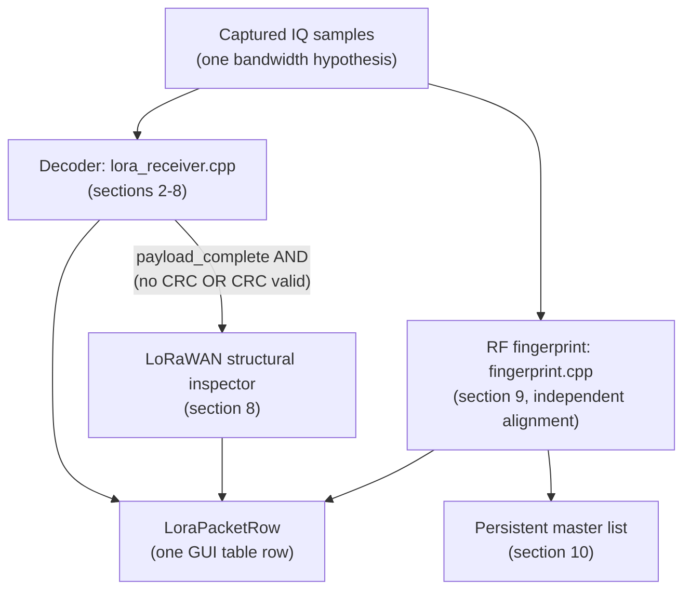
```mermaid
flowchart TD
    IQ["Captured IQ samples\n(one bandwidth hypothesis)"]
    IQ --> DEC["Decoder: lora_receiver.cpp\n(sections 2-8)"]
    IQ --> FP["RF fingerprint: fingerprint.cpp\n(section 9, independent alignment)"]
    DEC --> ROW["LoraPacketRow\n(one GUI table row)"]
    FP --> ROW
    FP --> MASTER["Persistent master list\n(section 10)"]
    DEC -->|"payload_complete AND\n(no CRC OR CRC valid)"| LORAWAN["LoRaWAN structural inspector\n(section 8)"]
    LORAWAN --> ROW
```

---

## 1. Detection stage

### 1.1 Preamble candidate & IQ polarity

**What it is.** The receiver doesn't assume the signal is right-side-up.
LoRaWAN downlinks (and some other traffic) transmit with *inverted* IQ —
the imaginary component negated, which flips a chirp's effective slope.
The decoder tries **both** polarities on every capture.

**How.** The whole capture is chopped into non-overlapping `N = 2^sf`
windows. Each window is coarsely dechirped (no zero-padding) against the
upchirp reference. A start index `i` becomes a preamble candidate only if
the next `min_preamble_symbols` (default 6) windows *all* clear
`minimum_peak_ratio` (0.5) *and* no consecutive pair drifts more than 1.5
bins. This whole search runs once on the IQ as captured, then again on
its complex conjugate (`std::conj()` on every sample) — that conjugation
*is* the inversion.

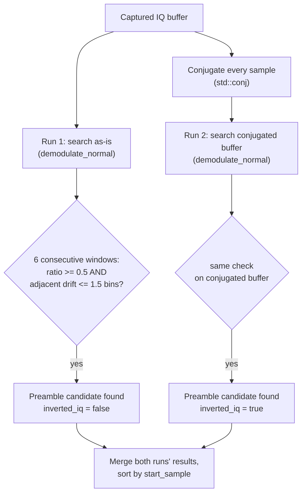
```mermaid
flowchart TD
    A["Captured IQ buffer"] --> B["Run 1: search as-is\n(demodulate_normal)"]
    A --> C["Conjugate every sample\n(std::conj)"]
    C --> D["Run 2: search conjugated buffer\n(demodulate_normal)"]
    B --> E{"6 consecutive windows:\nratio >= 0.5 AND\nadjacent drift <= 1.5 bins?"}
    D --> F{"same check\non conjugated buffer"}
    E -->|yes| G["Preamble candidate found\ninverted_iq = false"]
    F -->|yes| H["Preamble candidate found\ninverted_iq = true"]
    G --> I["Merge both runs' results,\nsort by start_sample"]
    H --> I
```

Results from Run 2 have their CFO/drift signs flipped back before
merging, so everything downstream reports in the *original* capture's
own convention regardless of which polarity actually decoded it.

### 1.2 SFD candidate

**What it is.** The point where the signal stops looking like more
preamble and starts looking like the Start-Frame-Delimiter's downchirps.

**How.** From right after a confirmed preamble run, each subsequent
window is dechirped against the *downchirp* reference. The first window
whose downchirp ratio clears 0.5 **and** exceeds that same window's own
already-computed upchirp ratio is the SFD candidate.

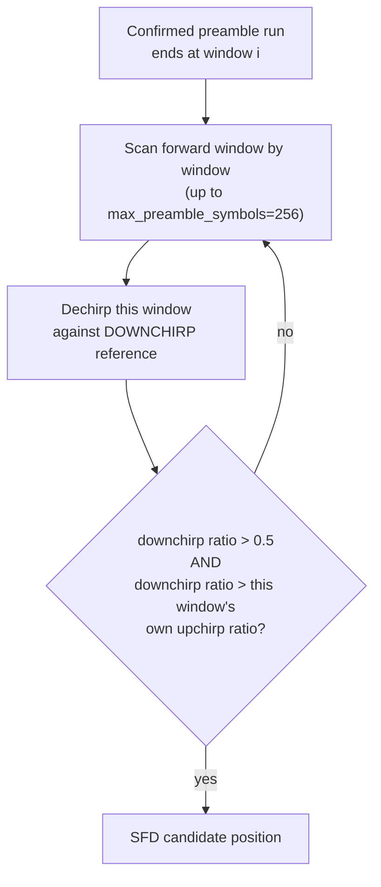
```mermaid
flowchart TD
    A["Confirmed preamble run\nends at window i"] --> B["Scan forward window by window\n(up to max_preamble_symbols=256)"]
    B --> C["Dechirp this window\nagainst DOWNCHIRP reference"]
    C --> D{"downchirp ratio > 0.5\nAND\ndownchirp ratio > this window's\nown upchirp ratio?"}
    D -->|no| B
    D -->|yes| E["SFD candidate position"]
```

### 1.3 Alignment (`aligned`)

**What it is.** The single most important internal value — the resolved
start of the SFD's first full downchirp, in sample position. Almost
every other parameter is measured relative to this point.

**How.** Two *fine* (8x zero-padded) measurements bracket the SFD
candidate: `u` (upchirp-matched, 4 symbols before it — still inside
preamble) and `d` (downchirp-matched, 1 symbol after it — inside the
SFD). Per the file's own comment, both slopes resolve timing/CFO up to
an N/2 ambiguity; `(d-u)/2` gives a candidate position correction, tried
at 3 half-symbol offsets × 3 symbol offsets (9 candidates). Each
candidate is scored by checking a window 3 symbols earlier still looks
like preamble *and* the candidate position plus the next symbol both
look like clean downchirps — highest combined ratio, subject to all
three individually clearing 0.5, wins.

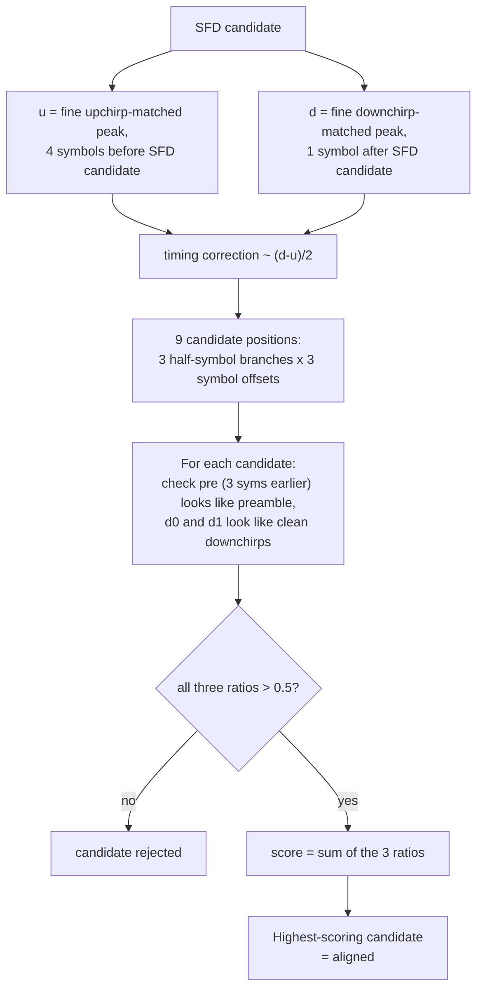
```mermaid
flowchart TD
    A["SFD candidate"] --> B["u = fine upchirp-matched peak,\n4 symbols before SFD candidate"]
    A --> C["d = fine downchirp-matched peak,\n1 symbol after SFD candidate"]
    B --> D["timing correction ~ (d-u)/2"]
    C --> D
    D --> E["9 candidate positions:\n3 half-symbol branches x 3 symbol offsets"]
    E --> F["For each candidate:\ncheck pre (3 syms earlier) looks like preamble,\nd0 and d1 look like clean downchirps"]
    F --> G{"all three ratios > 0.5?"}
    G -->|no| H["candidate rejected"]
    G -->|yes| I["score = sum of the 3 ratios"]
    I --> J["Highest-scoring candidate\n= aligned"]
```

### 1.4 Preamble peak ratio & SFD peak ratio

**What they are.** Two confidence numbers exposed directly in the GUI
("Preamble peak" / "SFD peak" columns) — how cleanly the preamble and
SFD dechirped, on a 0–1 scale where ~1.0 is a single dominant FFT bin and
lower values mean energy spread across many bins (noise, interference,
or **clipping** — see the previous turn's explanation for exactly why
clipping does this).

**How.** `preamble_peak_ratio` is the fine upchirp-matched ratio 3
symbols before `aligned` (comfortably inside clean preamble).
`sfd_peak_ratio` is the *worse* (minimum) of the two SFD downchirp
symbols' ratios — a conservative, weakest-link measure.

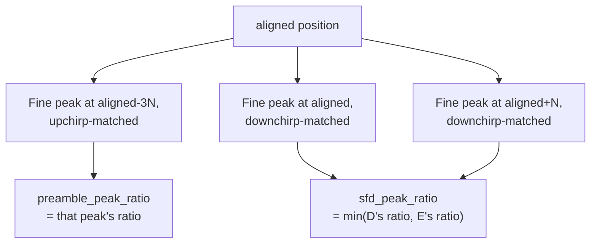
```mermaid
flowchart TD
    A["aligned position"] --> B["Fine peak at aligned-3N,\nupchirp-matched"]
    B --> C["preamble_peak_ratio\n= that peak's ratio"]
    A --> D["Fine peak at aligned,\ndownchirp-matched"]
    A --> E["Fine peak at aligned+N,\ndownchirp-matched"]
    D --> F["sfd_peak_ratio\n= min(D's ratio, E's ratio)"]
    E --> F
```

---

## 2. Timing / frequency parameters

### 2.1 CFO — bins and Hz

**What it is.** Carrier Frequency Offset: the transmitter's oscillator
and the receiver's own local oscillator are never perfectly matched.
Because a LoRa symbol's value *is* "which FFT bin has the peak," any CFO
shifts every symbol's measured bin by the same constant amount. This is
the decoder's own estimate — separate from, and computed differently
than, the RF fingerprint's `cfo_ppm` (§9.2).

**How.** Six preamble symbols well before `aligned` (offsets −8 through
−3 symbols) are fine-dechirped and fit with an ordinary least-squares
line: `bin ≈ slope·j + intercept`. `intercept` is `Packet::cfo_bins`.
`lora_observation.cpp` converts it to Hz for the GUI's "CFO estimate
(Hz)" column: `cfo_hz = cfo_bins * bandwidth_hz / 2^sf`.

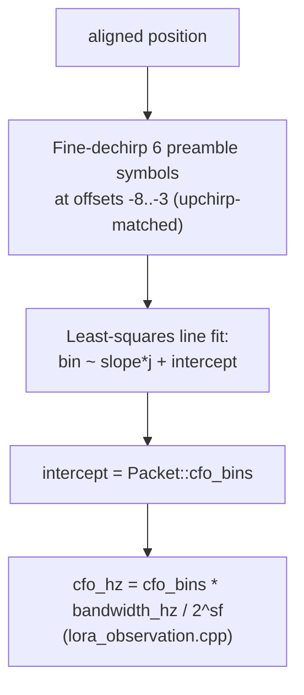
```mermaid
flowchart TD
    A["aligned position"] --> B["Fine-dechirp 6 preamble symbols\nat offsets -8..-3 (upchirp-matched)"]
    B --> C["Least-squares line fit:\nbin ~ slope*j + intercept"]
    C --> D["intercept = Packet::cfo_bins"]
    D --> E["cfo_hz = cfo_bins * bandwidth_hz / 2^sf\n(lora_observation.cpp)"]
```

If the winning hypothesis came from the inverted-IQ run, `cfo_bins` (and
therefore `cfo_hz`) is negated before being reported, so it always
describes the original, non-conjugated capture.

### 2.2 Drift — bins/symbol and Hz/symbol

**What it is.** The oscillator mismatch isn't perfectly constant — it
drifts slowly across a long packet. This is the *rate* of that drift.

**How.** The exact same linear fit as §2.1 — `slope` is the second
output of that one regression, reused (not recomputed) here. Converted
to Hz/symbol the same way as CFO.

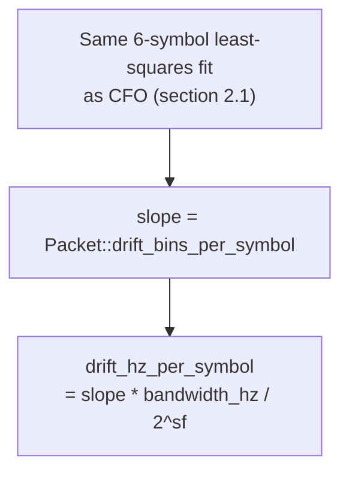
```mermaid
flowchart TD
    A["Same 6-symbol least-squares fit\nas CFO (section 2.1)"] --> B["slope = Packet::drift_bins_per_symbol"]
    B --> C["drift_hz_per_symbol\n= slope * bandwidth_hz / 2^sf"]
```

This drift model then feeds forward into *decoding itself*: ordinary
(non-LDRO) payload symbols get corrected by extrapolating this line
(`v - slope*(k+2.25)`), while header and LDRO-payload symbols use a
separate, adaptive mod-4-lattice tracker instead (see `lora_explainer.md`
§4 for that mechanism in detail — it's not a "parameter" with its own
output value, so no separate flowchart here).

### 2.3 Capture offset (s)

**What it is.** Where in this particular capture the packet's preamble
was found — a coarse position marker, not a hardware timestamp.

**How.** Trivial derivation, no fitting involved: the preamble's own
detected start sample, divided by the sample rate.

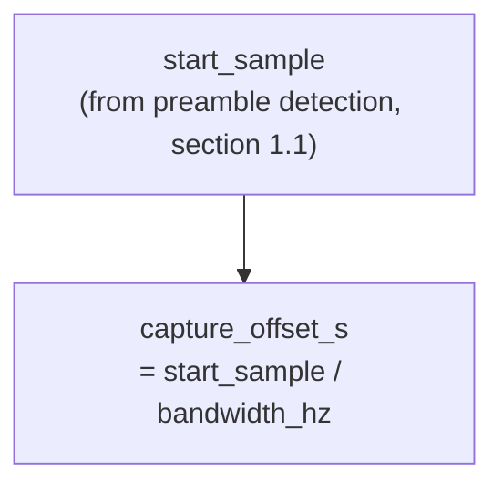
```mermaid
flowchart TD
    A["start_sample\n(from preamble detection, section 1.1)"] --> B["capture_offset_s\n= start_sample / bandwidth_hz"]
```

---

## 3. Header-derived parameters

All of §3 comes from one operation: dechirping the 8 symbols right after
the SFD, correcting them (§2's drift model, mod-4-lattice variant),
Gray-decoding, diagonally deinterleaving at width `sf-2`, and
FEC-decoding each resulting codeword at the header's fixed CR=4 (4/8).

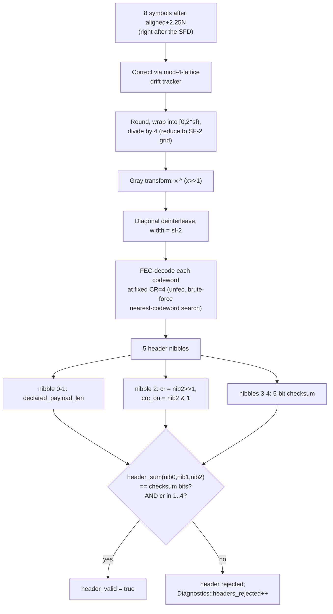
```mermaid
flowchart TD
    A["8 symbols after aligned+2.25N\n(right after the SFD)"] --> B["Correct via mod-4-lattice\ndrift tracker"]
    B --> C["Round, wrap into [0,2^sf),\ndivide by 4 (reduce to SF-2 grid)"]
    C --> D["Gray transform: x ^ (x>>1)"]
    D --> E["Diagonal deinterleave,\nwidth = sf-2"]
    E --> F["FEC-decode each codeword\nat fixed CR=4 (unfec, brute-force\nnearest-codeword search)"]
    F --> G["5 header nibbles"]
    G --> H["nibble 0-1: declared_payload_len"]
    G --> I["nibble 2: cr = nib2>>1,\ncrc_on = nib2 & 1"]
    G --> J["nibbles 3-4: 5-bit checksum"]
    H --> K{"header_sum(nib0,nib1,nib2)\n== checksum bits?\nAND cr in 1..4?"}
    I --> K
    J --> K
    K -->|yes| L["header_valid = true"]
    K -->|no| M["header rejected;\nDiagnostics::headers_rejected++"]
```

- **§3.1 Declared payload length** — nibbles 0–1, `nib[0]*16 + nib[1]`.
- **§3.2 Coding rate (CR)** — nibble 2, bits 1–3 (`nib[2]>>1`). Displayed
  as `4/(4+cr)` — CR=3 shows as "4/7".
- **§3.3 CRC-on flag** — nibble 2, bit 0 (`nib[2]&1`).
- **§3.4 Header checksum validity** — a fixed 5×12 binary parity-check
  matrix (`header_sum()`), cross-checked against the independent
  LoRaPHY reference and its published test vector. This is the gate
  that decides `header_valid`.
- **SF itself** isn't calculated here — it's one of the (bandwidth, SF)
  hypotheses the scan loop already tries (§ of `lora_explainer.md` §2);
  a header only validates *if* the hypothesis being tried happens to be
  the transmitter's real SF.

If `sf-2 > 5`, the leftover nibbles beyond the first 5 (still from this
same 8-symbol block, still coded at CR=4) are already the start of the
payload — carried into §5 as a head-start on `data`, not re-derived
there.

---

## 4. LDRO parameters

### 4.1 LDRO on/off, 4.2 LDRO ambiguous

**What they are.** Low Data Rate Optimization — whether the payload's
symbol alphabet was reduced by 2 bits. Not signalled anywhere in the
header; the receiver has to *infer* it by trying both possibilities.

**How.**

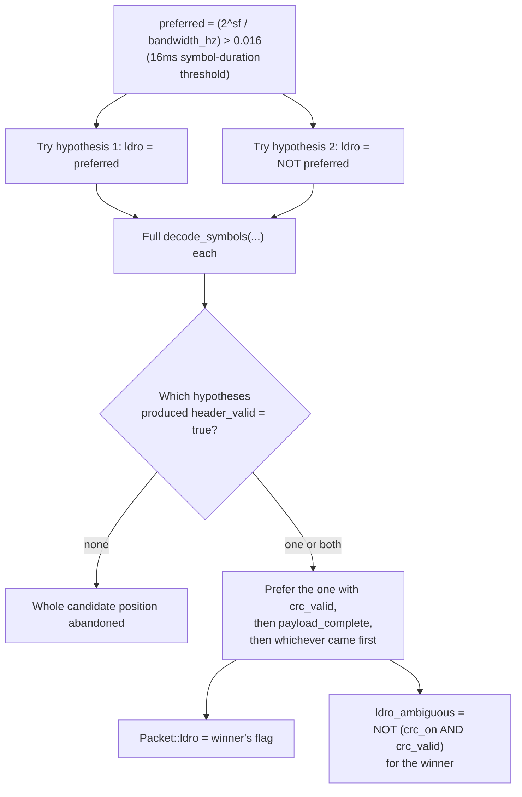
```mermaid
flowchart TD
    A["preferred = (2^sf / bandwidth_hz) > 0.016\n(16ms symbol-duration threshold)"] --> B["Try hypothesis 1: ldro = preferred"]
    A --> C["Try hypothesis 2: ldro = NOT preferred"]
    B --> D["Full decode_symbols(...) each"]
    C --> D
    D --> E{"Which hypotheses\nproduced header_valid = true?"}
    E -->|"none"| F["Whole candidate position abandoned"]
    E -->|"one or both"| G["Prefer the one with crc_valid,\nthen payload_complete,\nthen whichever came first"]
    G --> H["Packet::ldro = winner's flag"]
    G --> I["ldro_ambiguous =\nNOT (crc_on AND crc_valid)\nfor the winner"]
```

`ldro_ambiguous` is what shows as `On?`/`Off?` in the GUI's LDRO column
— it's true whenever the winning hypothesis's own CRC didn't actually
confirm the choice (CRC absent, or CRC present but failed), meaning the
LDRO value shown is a best guess, not a confirmed fact.

---

## 5. Sync word parameters

### 5.1 Raw sync bins, 5.2 Quantized sync word

**What they are.** Two symbols immediately before `aligned` carry a
sync-word byte (e.g. `0x12`). **Production never gates on this** — it's
observed and reported only (see `lora_explainer.md` §8 for why, and why
that's different from the legacy laboratory codec).

**How.**

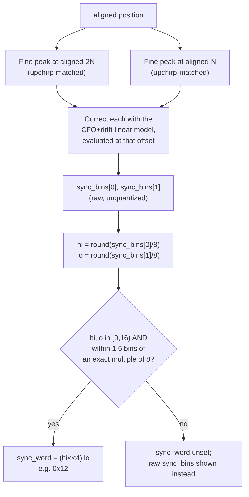
```mermaid
flowchart TD
    A["aligned position"] --> B["Fine peak at aligned-2N\n(upchirp-matched)"]
    A --> C["Fine peak at aligned-N\n(upchirp-matched)"]
    B --> D["Correct each with the\nCFO+drift linear model,\nevaluated at that offset"]
    C --> D
    D --> E["sync_bins[0], sync_bins[1]\n(raw, unquantized)"]
    E --> F["hi = round(sync_bins[0]/8)\nlo = round(sync_bins[1]/8)"]
    F --> G{"hi,lo in [0,16) AND\nwithin 1.5 bins of\nan exact multiple of 8?"}
    G -->|yes| H["sync_word = (hi<<4)|lo\ne.g. 0x12"]
    G -->|no| I["sync_word unset;\nraw sync_bins shown instead"]
```

This fixed "divide by 8, no SF-dependent shift" mapping is the same
convention the independent LoRaPHY reference uses, and it's what the
real SX1262 hardware capture actually decoded to (`0x12`) — see the
previous turn's summary of the SX1262 validation work.

---

## 6. Payload parameters

### 6.1 FEC disagreements

**What it is.** How many codewords (across *both* the header's 8 symbols
and every payload block) needed any correction at all — not a corrected-
bit count, just a count of "the received codeword wasn't already a
perfect match to some valid codeword."

**How.** Every call to `unfec()` (brute-force nearest-of-16-candidates
search) increments a shared counter whenever the winning candidate's
Hamming distance to the received codeword is nonzero.

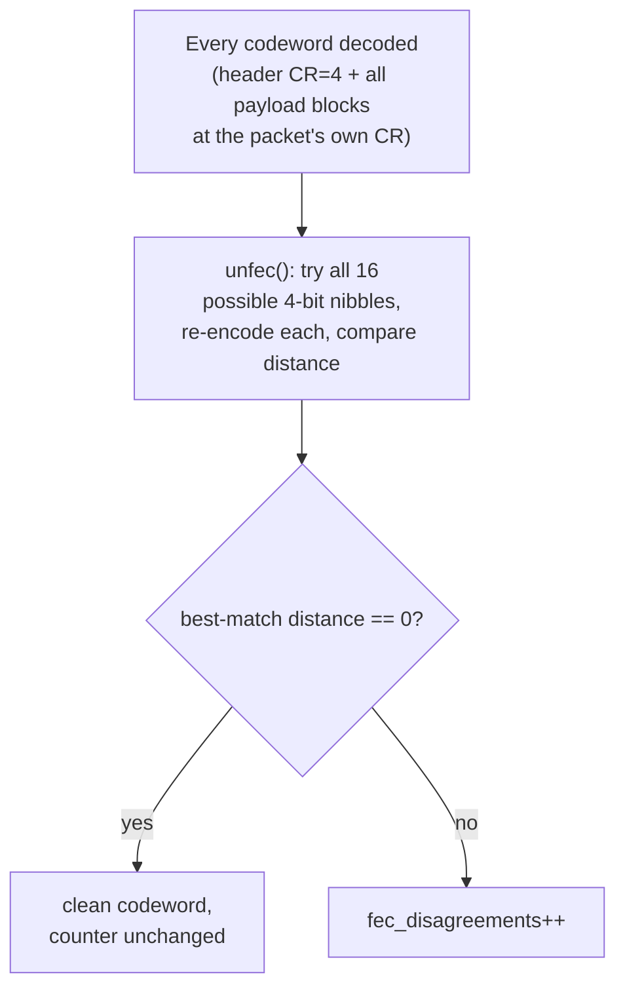
```mermaid
flowchart TD
    A["Every codeword decoded\n(header CR=4 + all payload blocks\nat the packet's own CR)"] --> B["unfec(): try all 16\npossible 4-bit nibbles,\nre-encode each, compare distance"]
    B --> C{"best-match distance == 0?"}
    C -->|yes| D["clean codeword,\ncounter unchanged"]
    C -->|no| E["fec_disagreements++"]
```

A CRC can still pass with a nonzero count here (a real SX1262 capture
showed exactly this: 3 mismatched codewords, CRC still valid) — CR≥2's
extra parity bits can correct some errors outright, and a parity-only
CR=1 codeword that ties between candidates just falls back to the raw
received bits without "fixing" anything, which may still happen to be
right.

### 6.2 Payload bytes

**How.** Once required symbols are available, each payload block (`cr+4`
symbols wide) is corrected (§2's model — linear extrapolation for
ordinary symbols, mod-4-lattice for LDRO symbols), Gray-transformed
(with the LDRO-specific "÷4" or the ordinary-payload-specific "−1"
adjustment — these are genuinely different, not the same operation; see
`lora_explainer.md` §7), deinterleaved, FEC-decoded, nibble-packed into
bytes (payload's own **low-nibble-first** order — opposite of the
header's high-nibble-first order), then dewhitened with an 8-bit LFSR
(taps at bits 7/5/4/3, seeded `0xFF`) applied only to the declared
payload bytes, never the trailing CRC bytes.

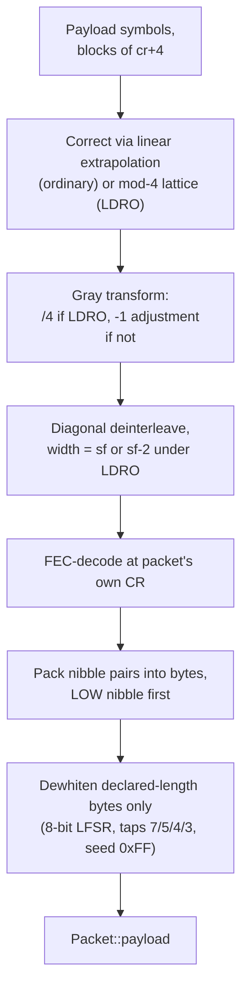
```mermaid
flowchart TD
    A["Payload symbols,\nblocks of cr+4"] --> B["Correct via linear extrapolation\n(ordinary) or mod-4 lattice (LDRO)"]
    B --> C["Gray transform:\n /4 if LDRO, -1 adjustment if not"]
    C --> D["Diagonal deinterleave,\nwidth = sf or sf-2 under LDRO"]
    D --> E["FEC-decode at packet's own CR"]
    E --> F["Pack nibble pairs into bytes,\nLOW nibble first"]
    F --> G["Dewhiten declared-length bytes only\n(8-bit LFSR, taps 7/5/4/3, seed 0xFF)"]
    G --> H["Packet::payload"]
```

### 6.3 Payload CRC validity / payload_complete

**How.**

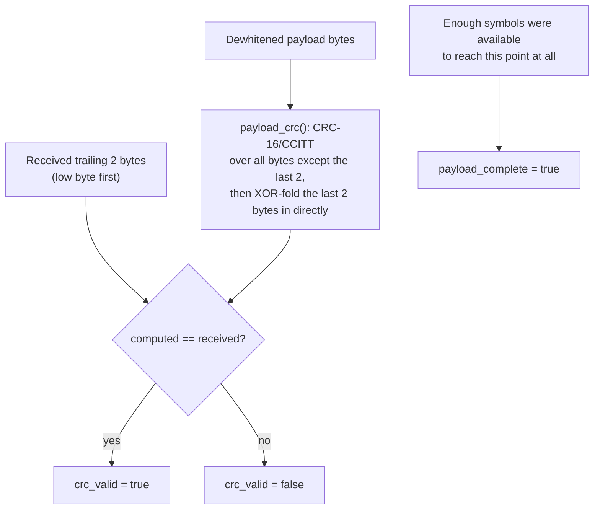
```mermaid
flowchart TD
    A["Dewhitened payload bytes"] --> B["payload_crc(): CRC-16/CCITT\nover all bytes except the last 2,\nthen XOR-fold the last 2 bytes in directly"]
    C["Received trailing 2 bytes\n(low byte first)"] --> D{"computed == received?"}
    B --> D
    D -->|yes| E["crc_valid = true"]
    D -->|no| F["crc_valid = false"]
    G["Enough symbols were available\nto reach this point at all"] --> H["payload_complete = true"]
```

`payload_complete` and `crc_valid` are independent: a truncated capture
can leave `payload_complete = false` with CRC never attempted at all
(shown as "Header only" in the GUI, per the integrity table in
`lora_explainer.md` §9).

---

## 7. LoRaWAN structural parameters

**Gate before any of this runs**: `payload_complete && (!crc_on ||
crc_valid)` — a LoRaWAN candidate is only ever attempted against bytes
that are either CRC-verified or declared not to carry a CRC at all;
never against a failed or incomplete payload.

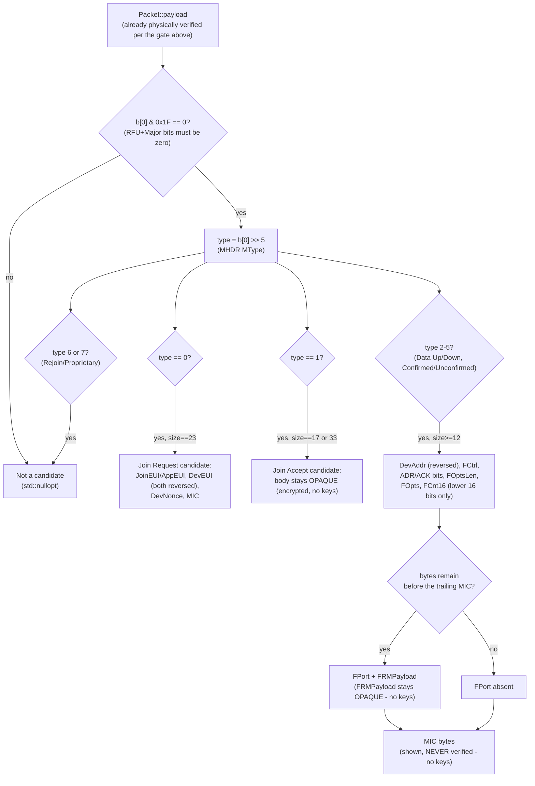
```mermaid
flowchart TD
    A["Packet::payload\n(already physically verified per the gate above)"] --> B{"b[0] & 0x1F == 0?\n(RFU+Major bits must be zero)"}
    B -->|no| Z["Not a candidate\n(std::nullopt)"]
    B -->|yes| C["type = b[0] >> 5\n(MHDR MType)"]
    C --> D{"type == 0?"}
    D -->|yes, size==23| E["Join Request candidate:\nJoinEUI/AppEUI, DevEUI (both reversed),\nDevNonce, MIC"]
    C --> F{"type == 1?"}
    F -->|yes, size==17 or 33| G["Join Accept candidate:\nbody stays OPAQUE (encrypted, no keys)"]
    C --> H{"type 2-5?\n(Data Up/Down, Confirmed/Unconfirmed)"}
    H -->|yes, size>=12| I["DevAddr (reversed), FCtrl,\nADR/ACK bits, FOptsLen,\nFOpts, FCnt16 (lower 16 bits only)"]
    I --> J{"bytes remain\nbefore the trailing MIC?"}
    J -->|yes| K["FPort + FRMPayload\n(FRMPayload stays OPAQUE - no keys)"]
    J -->|no| L["FPort absent"]
    K --> M["MIC bytes\n(shown, NEVER verified - no keys)"]
    L --> M
    C --> N{"type 6 or 7?\n(Rejoin/Proprietary)"}
    N -->|yes| Z
```

Every branch that produces a result appends the same fixed disclaimer:
*"Structural candidate only; MIC not verified, protocol/session/version
not established. No decryption."* Nothing here can be verified without
the actual session keys — see the two turns back for the full
cleartext-vs-encrypted breakdown of the LoRaWAN frame.

---

## 8. RF fingerprint parameters (a separate system)

Everything in this section runs independently of §§1–7, on its own
alignment from `lora::detect_burst()` — a simpler, older preamble
detector, not the decoder's `aligned` position. It runs *whether or not*
a header ever decodes, which is the whole point: TarangMini's traffic
mostly never decoded a header at all in earlier sessions, and this is
how any hardware characterization was still possible on it.

### 8.1 SNR (dB) — the first gate

**How.**

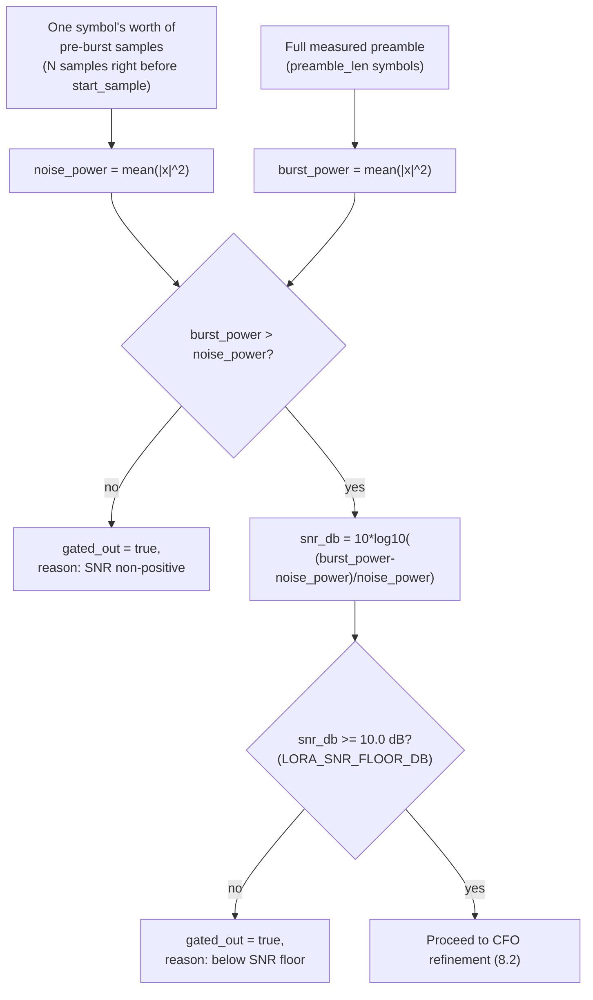
```mermaid
flowchart TD
    A["One symbol's worth of\npre-burst samples\n(N samples right before start_sample)"] --> B["noise_power = mean(|x|^2)"]
    C["Full measured preamble\n(preamble_len symbols)"] --> D["burst_power = mean(|x|^2)"]
    B --> E{"burst_power > noise_power?"}
    D --> E
    E -->|no| F["gated_out = true,\nreason: SNR non-positive"]
    E -->|yes| G["snr_db = 10*log10(\n(burst_power-noise_power)/noise_power)"]
    G --> H{"snr_db >= 10.0 dB?\n(LORA_SNR_FLOOR_DB)"}
    H -->|no| I["gated_out = true,\nreason: below SNR floor"]
    H -->|yes| J["Proceed to CFO refinement (8.2)"]
```

### 8.2 CFO (ppm) — not the same number as §2.1

**Why it's a separate calculation.** The decoder's `cfo_bins`/`cfo_hz`
(§2.1) is a *bin-domain* quantity — the function that computes it never
even receives the absolute RF center frequency, only bandwidth. The
fingerprint's `cfo_ppm` genuinely needs the carrier frequency (it's
`center_hz`-relative by definition), uses a *different* estimator
(Moose-style differential correlation, not a linear regression), and a
*different* alignment (`detect_burst()`, not `aligned`). They describe
related but not identical measurements and are not expected to match
exactly.

**How.**

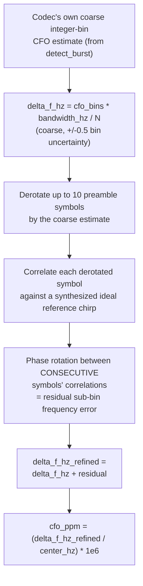
```mermaid
flowchart TD
    A["Codec's own coarse integer-bin\nCFO estimate (from detect_burst)"] --> B["delta_f_hz = cfo_bins * bandwidth_hz / N\n(coarse, +/-0.5 bin uncertainty)"]
    B --> C["Derotate up to 10 preamble symbols\nby the coarse estimate"]
    C --> D["Correlate each derotated symbol\nagainst a synthesized ideal reference chirp"]
    D --> E["Phase rotation between CONSECUTIVE\nsymbols' correlations\n= residual sub-bin frequency error"]
    E --> F["delta_f_hz_refined =\ndelta_f_hz + residual"]
    F --> G["cfo_ppm = (delta_f_hz_refined / center_hz) * 1e6"]
```

### 8.3 IRR (dB), IQ eps, IQ phi (deg), DC (dBc), DC angle (deg)

**What they are.** Radio-hardware characteristics — image-rejection
ratio, gain/phase imbalance between the I and Q channels, and residual
DC offset (as a ratio/angle relative to the signal). These are the
"stable core" identity features the persistent master list matches
devices on (§10).

**How.** One 3×3 complex least-squares solve.

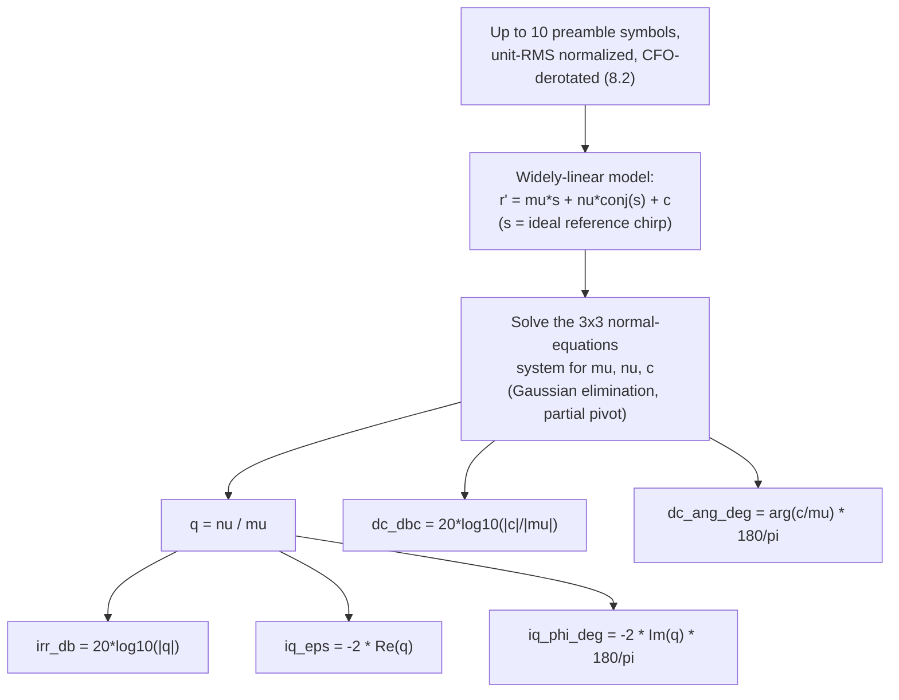
```mermaid
flowchart TD
    A["Up to 10 preamble symbols,\nunit-RMS normalized, CFO-derotated (8.2)"] --> B["Widely-linear model:\nr' = mu*s + nu*conj(s) + c\n(s = ideal reference chirp)"]
    B --> C["Solve the 3x3 normal-equations\nsystem for mu, nu, c\n(Gaussian elimination, partial pivot)"]
    C --> D["q = nu / mu"]
    D --> E["irr_db = 20*log10(|q|)"]
    D --> F["iq_eps = -2 * Re(q)"]
    D --> G["iq_phi_deg = -2 * Im(q) * 180/pi"]
    C --> H["dc_dbc = 20*log10(|c|/|mu|)"]
    C --> I["dc_ang_deg = arg(c/mu) * 180/pi"]
```

### 8.4 EVM (%) and sync_corr — the second gate

**How.**

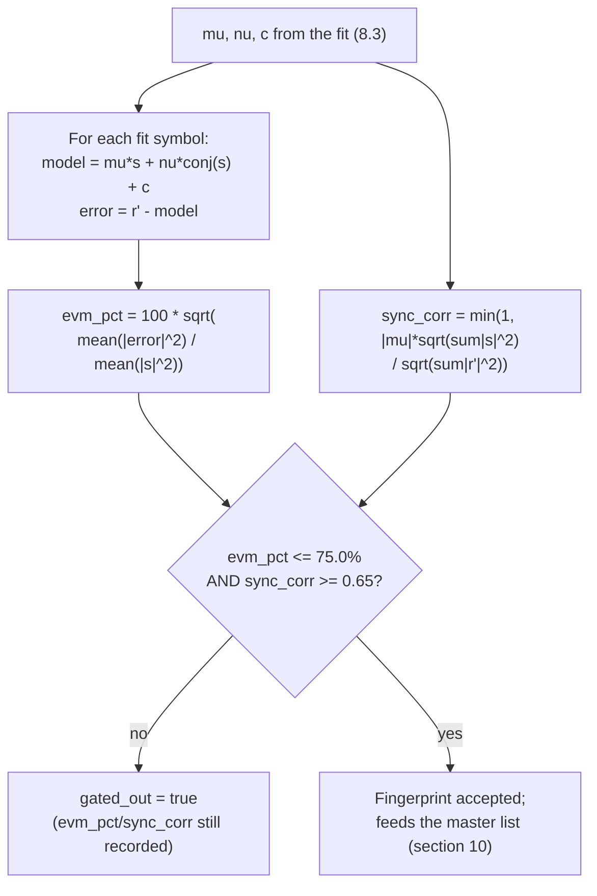
```mermaid
flowchart TD
    A["mu, nu, c from the fit (8.3)"] --> B["For each fit symbol:\nmodel = mu*s + nu*conj(s) + c\nerror = r' - model"]
    B --> C["evm_pct = 100 * sqrt(\nmean(|error|^2) / mean(|s|^2))"]
    A --> D["sync_corr = min(1, |mu|*sqrt(sum|s|^2)\n/ sqrt(sum|r'|^2))"]
    C --> E{"evm_pct <= 75.0%\nAND sync_corr >= 0.65?"}
    D --> E
    E -->|no| F["gated_out = true\n(evm_pct/sync_corr still recorded)"]
    E -->|yes| G["Fingerprint accepted;\nfeeds the master list (section 10)"]
```

Both thresholds were calibrated from real controlled TarangMini data,
not the generic numbers a first pass assumed — see `fingerprint.hpp`'s
own comments for that calibration history.

---

## 9. Persistent identity: master-list matching

**What it produces.** Which device ID (`LORA-0001`, etc.) an accepted
fingerprint reading gets attributed to — a new device, or an existing
one.

**How.** Only ever runs on readings that already cleared *both* gates in
§8 (never a gated-out reading).

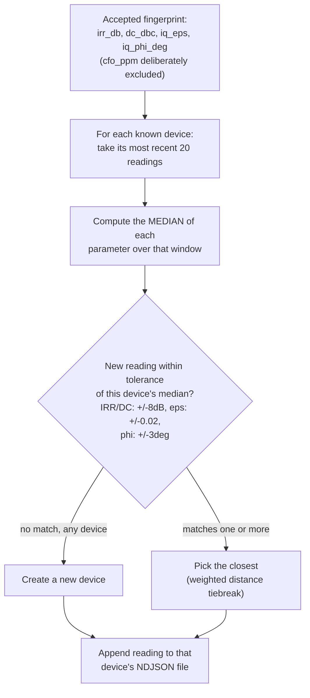
```mermaid
flowchart TD
    A["Accepted fingerprint:\nirr_db, dc_dbc, iq_eps, iq_phi_deg\n(cfo_ppm deliberately excluded)"] --> B["For each known device:\ntake its most recent 20 readings"]
    B --> C["Compute the MEDIAN of each\nparameter over that window"]
    C --> D{"New reading within tolerance\nof this device's median?\nIRR/DC: +/-8dB, eps: +/-0.02,\nphi: +/-3deg"}
    D -->|no match, any device| E["Create a new device"]
    D -->|matches one or more| F["Pick the closest\n(weighted distance tiebreak)"]
    E --> G["Append reading to that\ndevice's NDJSON file"]
    F --> G
```

`cfo_ppm` is deliberately excluded from this match even though it's
computed (§8.2) and stored per-reading — real controlled testing showed
it swinging tens of ppm burst-to-burst for one confirmed physical
device, most likely receiver-LO variance rather than device identity.

---

## 10. Quick reference

| Parameter | Where computed | GUI column |
|---|---|---|
| IQ polarity | `lora_receiver.cpp::demodulate` | IQ polarity |
| Preamble peak ratio | `lora_receiver.cpp::demodulate_normal` | Preamble peak |
| SFD peak ratio | `lora_receiver.cpp::demodulate_normal` | SFD peak |
| CFO (bins / Hz) | linear fit, `demodulate_normal` / converted in `lora_observation.cpp` | CFO (bins) / CFO estimate (Hz) |
| Drift (bins / Hz per symbol) | same linear fit | Drift (Hz/symbol) |
| Capture offset (s) | `lora_observation.cpp` | Capture offset (s) |
| Declared payload length, CR, CRC-on, header_valid | `decode_symbols` header block | Header len, CR, Header |
| LDRO / LDRO ambiguous | `demodulate_normal`'s two-hypothesis trial | LDRO |
| Sync bins / sync word | `demodulate_normal` | Sync observed |
| FEC disagreements | `unfec()`, accumulated in `decode_symbols` | FEC mismatches |
| Payload bytes / CRC valid | `decode_symbols` payload block | Payload / Payload CRC |
| LoRaWAN candidate + fields | `lorawan_inspect.hpp` | LoRaWAN structure |
| SNR (dB) | `fingerprint.cpp` SNR gate | SNR (dB) |
| CFO (ppm) | `fingerprint.cpp` Moose estimator | CFO (ppm) |
| IRR/IQ eps/IQ phi/DC dBc/DC angle | `fingerprint.cpp` 3x3 LS fit | IRR (dB), IQ eps, IQ phi (deg), DC (dBc), DC ang (deg) |
| EVM (%) / sync_corr | `fingerprint.cpp` fit-quality gate | EVM (%), Sync corr |
| Device ID | `lora_master.cpp` matching | LoRa Master Emitters table |
